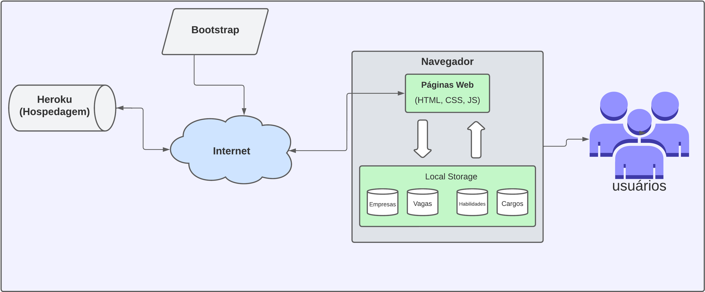
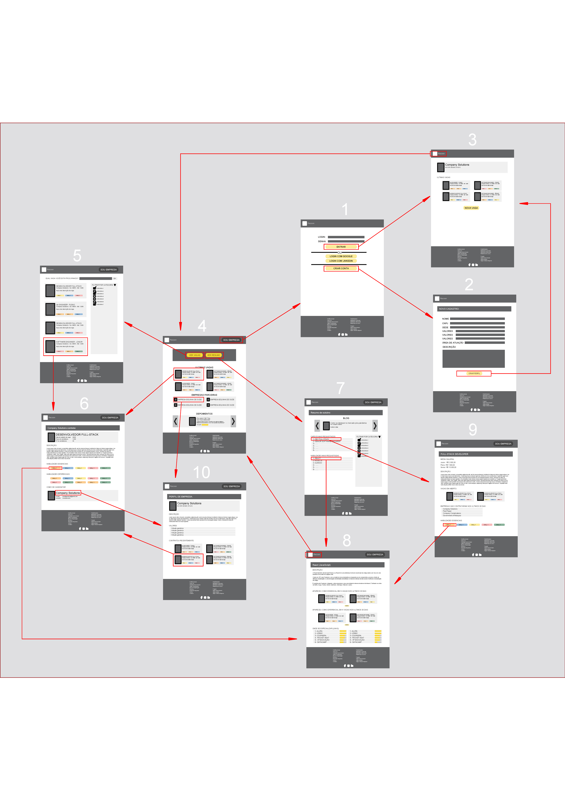

# Arquitetura da Solução

Pré-requisitos: <a href="3-Projeto de Interface.md"> Projeto de Interface</a>

Aqui abordaremos como o software é estruturado em termos dos componentes que fazem parte da solução.

## Diagrama de componentes

O Diagrama permite a modelagem física de um sistema, através da visão dos seus componentes e relacionamentos entre os mesmos, assim definindo componentes que serão utilizados durante o desenvolvimento da solução.

Os componentes que fazem parte da solução são apresentados na Figura diagramaDeComponentes.

Figura diagramaDeComponentes - Arquitetura da Solução

A solução implementada conta com os seguintes módulos:
- **Navegador** - Interface básica do sistema  
  - **Páginas Web** - Conjunto de arquivos HTML, CSS, JavaScript e imagens que implementam as funcionalidades do sistema.
   - **Local Storage** - Armazenamento mantido no Navegador, onde são implementados bancos de dados baseados em JSON. São eles: 
     - **Empresas** - Informações de registro, descritivos da empresa e lista de vagas.
     - **Vagas** - Lista de vagas contendo informações pertinentes a vaga como salario, cargos etc.
     - **Habilidades** - Lista de habilidades para informar os usuários sobre as habilidades mais valorizadas dentre as com ofertas de vagas no site.  
     - **Cargos** - Lista de cargos para informar os usuários sobre os cargos mais valorizados dentre as ofertas de vaga no site
 - **Hospedagem** - local na Internet onde as páginas são mantidas e acessadas pelo navegador (Heroku). 
 - **Bootstrap** - CSS framework gratuito open-source com o objetivo de gerar designs responsivos entre mobile/web 

## Tecnologias utilizadas

Uma breve descrição das tecnologias utilizadas em nossa solução.

- `HTML`: É uma linguagem de marcação utilizada na construção e estruturação de páginas na Web.

- `CSS`: É a sigla para o termo em inglês Cascading Style Sheets, e é utilizada para estilizar paginas Web.

- `JavaScript`: É uma linguagem de programação comumente utilizada com HTML e CSS para controlar e definir funcionalidades.

- `AutoCAD`: Ferramenta de desenhos de projetos 2d/3d precisos.

- `Lucid`: Ferramenta para criação de diagramas.

- `MarvelApp`: Ferramenta para criar protótipos com maior estilização e facilidade.

- `Trello`: Ferramenta para organização de tarefas e distribuição de atividades.

- `WhatsApp`: Ferramenta para comunicação da equipe e acompanhamento de tarefas.

- `Discord`: Ferramenta para video conferencias e reuniões da equipe.

- `Git, GitHub, GitHub Desktop`: Ferramenta para organização e versionamento do projeto.

- `Visual Studio Code`: (IDE) Editor de código para agilizar o trabalho e aumentar produtividade.

- `Heroku`: Plataforma em nuvem para hospedagem da aplicação.

## Fluxo de usuário

A seguir será introduzido um fluxo de usuário simplificado para melhor entendimento
de nossa solução, e por ultimo uma imagem com o fluxo completo e o endereço do pdf.

A imagem a seguir ilustra a o fluxo do usuário em nossa solução. Assim
que o usuário entra na plataforma, ele é apresentado à tela inicial
(Tela 4) onde ele vê um breve resumo das ultimas vagas postadas alguns
depoimentos de usuários e é confrontado com as opções de ver vagas,
ver resumo ou se identificar como empresa.

Caso ele opte por seguir como empresa (Sou empresa), ele é
redirecionado para a tela de login (Tela 1), onde pode
efetuar login e será redirecionado para o perfil da empresa (Tela 3)
ou optar por se registrar 

Caso ele opte por se registrar ele sera redirecionado para a tela (Tela 2),
onde preencherá suas informações e ao fim será redirecionado
para o perfil da empresa (Tela 3)

Caso ele opte por ver resumo, ele será redirecionado para a tela
de resumo do mês onde poderá ver um resumo das habilidades
e cargos mais requisitados (Tela 7) e terá as opções de 
clicar em uma habilidade ou cargo

Caso ele opte por ver um cargo especifico, será redirecionado para
a visualização desse cargo com informações sobre salario, descrição
e até mesmo links de estudo (Tela 9)

Caso opte por ver uma habilidade em especifico, será redirecionado para
a visualização dessa habilidade com informações sobre salario, descrição
e até mesmo links de estudo (Tela 8)

Caso ele opte por seguir em ver vagas, ele é redirecionado para a 
visualização de vagas em lista (Tela 5), aqui ele possui a liberdade
de realizar filtros e em seguida escolher uma vaga, no qual ele será
redirecionado para a visualização completa da vaga (Tela 6) onde ele
tem a opção de visualizar o perfil da empresa.

Caso ele opte por seguir em perfil da empresa (Tela 10) ele terá um
descritivo da empresa contratante e outras vagas postadas por essa
empresa.

Em qualquer momento o usuario pode clicar no titulo da pagina (Raccoon)
para voltar a tela inicial (Tela 4)

O fluxo completo em pdf poderá ser encontrado em (img/fluxoDeUsuario.pdf)
Para uma melhor leitura.

## Hospedagem

Hospedagem ainda não realizada.

> **Links Úteis**:
>
> - [Website com GitHub Pages](https://pages.github.com/)
> - [Programação colaborativa com Repl.it](https://repl.it/)
> - [Getting Started with Heroku](https://devcenter.heroku.com/start)
> - [Publicando Seu Site No Heroku](http://pythonclub.com.br/publicando-seu-hello-world-no-heroku.html)