# Registro de Testes de Software

Os resultados obtidos seguindo o <a href="08-Plano de Testes de Software.md"> Plano de Testes de Software </a> serão descritos a seguir

Consulte <a href="02-Especificação do Projeto.md"> Especificação do Projeto </a> para melhor entendimento dos requisitos que serão trabalhados a seguir.

Gravidade

- Sucesso: Nenhuma ação necessária
- Grave: Ação obrigatória antes da entrega final do projeto
- Media: Ação recomendada para melhora da qualidade do software
- Baixa: Ação não obrigatória mas que melhoraria a qualidade do software

# Testes de Ponta a ponta simplificado
|ID    | Descrição do teste  |  Descrição do resultado | Gravidade|
|------|---------------------|-------------------------|----------|
|CT-?   RF-001|  | | | 
|CT-?   RF-002|  | | |
|CT-?   RF-003| Verificar se a página "lista de vagas" está acessível e interativa. | A página se mostrou em pleno funcionamento, apresentando a lista de vagas adequadamente | Sucesso |
|CT-?   RF-007| Verificar se a barra de pesquisa encontra vagas validas corretamente. | A barra de pesquisa funcionou perfeitamente retornando resultado esperados do teste | Sucesso | 
|CT-?   RF-007| Verificar se a barra de pesquisa não exibe resultados ao efetuar uma pesquisa de uma vaga inexistente. | A barra de pesquisa funcionou perfeitamente retornando uma lista vazia, resultado esperado do teste | Sucesso | 
|CT-?   RF-007| Verificar se o filtro por categoria está encontra vagas validas corretamente. | O filtro por categoria funcionou perfeitamente retornando resultado esperados do teste | Sucesso | 
|CT-?   RF-005| Deve ser possível chegar a pagina de criação de vaga atráves da aplicação | A pagina foi exibida adequadamente e dinamicamente |  Sucesso |
|CT-?   RF-005| Deve ser possível criar uma nova vaga seguindo todo o processo com informações validas | A vaga foi criada corretamente e exibida de acordo |  Sucesso |
|CT-?   RF-005| Deve ser impossível criar uma nova vaga seguindo todo o processo com todas as informações em branco | Um erro foi exibido conforme o esperado e informando os campos que devem ser preenchidos |  Sucesso |
|CT-?   RF-013| Deve ser possível acessar a pagina de login seguindo todo o processo pela aplicação | A pagina foi exibida adequadamente e dinamicamente |  Sucesso |
|CT-?   RF-013| Deve ser possível acessar a pagina de registro seguindo todo o processo pela aplicação | A pagina foi exibida adequadamente e dinamicamente |  Sucesso |
|CT-?   RF-013| Deve ser possível se registrar com sucesso seguindo os passos e inserindo informações validas | O cadastro foi efetuado com sucesso e pagina da empresa exibida |  Sucesso |
|CT-?   RF-013| Deve ser impossível se registrar com todos os campos em branco | Um erro foi exibido como esperado e não foi possível efetuar o cadastro |  Sucesso |
|CT-?   RF-013| Deve ser possível efetuar login seguindo os passos e inserindo informações validas | O login foi efetuado com sucesso e pagina da empresa foi exibida de acordo |  Sucesso |
|CT-?   RF-013| Deve ser impossível efetuar login com todos os campos em branco | Um erro foi exibido como o esperado e não foi possível efetuar login |  Sucesso |
|CT-?   RF-013| Deve ser impossível efetuar login seguindo os passos e inserindo um email valido e uma senha invalida | Um erro foi exibido como o esperado e não foi possível efetuar login |  Sucesso |
|CT-?   RF-013| Deve ser impossível efetuar login seguindo os passos e inserindo um email invalido e uma senha valida | Um erro foi exibido como o esperado e não foi possível efetuar login |  Sucesso |

# Testes de Campos simplificado
|ID    | Descrição do teste  |  Descrição do resultado | Gravidade|
|------|---------------------|-------------------------|----------|
|CT-?   RF-005| Deve ser possível inserir um nome na vaga com quaisquer caracteres, números ou caracteres especiais. | O redirecionamento para o perfil aconteceu e a vaga foi criada com sucesso com o nome: aaAA11!@#$%¨¨&*()_{}[] |  Sucesso |
|CT-?   RF-005| Deve ser impossível criar um vaga sem nome | Um erro foi exibido como esperado e não foi possível criar a vaga |  Sucesso |
|CT-?   RF-005| Deve ser possível selecionar uma ou mais habilidades essenciais | O redirecionamento para o perfil aconteceu e a vaga foi criada com sucesso com as habilidades essenciais: Javascript, HTML, REACT |  Sucesso |
|CT-?   RF-005| Deve ser impossível criar uma vaga sem habilidades essenciais | Um erro foi exibido como esperado e não foi possível criar a vaga |  Sucesso |
|CT-?   RF-005| Deve ser possível selecionar uma ou mais habilidades diferenciais | O redirecionamento para o perfil aconteceu e a vaga foi criada com sucesso com as habilidades diferenciais: Golang e Python |  Sucesso |
|CT-?   RF-005| Deve ser possível criar uma vaga sem habilidades diferenciais | O redirecionamento para o perfil aconteceu e a vaga foi criada com sucesso sem habilidades difereiciais |  Sucesso |
|CT-?   RF-005| Deve ser possível selecionar uma senioridade | O redirecionamento para o perfil aconteceu e a vaga foi criada com sucesso |  Sucesso |
|CT-?   RF-005| Deve ser impossível criar uma vaga sem senioridade | Um erro foi exibido como esperado e não foi possível criar a vaga |  Sucesso |
|CT-?   RF-005| Deve ser possível selecionar um cargo | O redirecionamento para o perfil aconteceu e a vaga foi criada com sucesso |  Sucesso |
|CT-?   RF-005| Deve ser impossível criar uma vaga sem cargo | Um erro foi exibido como esperado e não foi possível criar a vaga |  Sucesso |
|CT-?   RF-005| Deve ser possível definir um salario para a vaga | O redirecionamento para o perfil aconteceu e a vaga foi criada com sucesso |  Sucesso |
|CT-?   RF-005| Deve ser impossível criar uma vaga sem salario | Um erro foi exibido como esperado e não foi possível criar a vaga |  Sucesso |
|CT-?   RF-005| Deve ser possível definir um salario para a vaga | O redirecionamento para o perfil aconteceu e a vaga foi criada com sucesso |  Sucesso |
|CT-?   RF-005| Deve ser impossível criar uma vaga com data para expiração da vaga anterior ao dia atual | A vaga foi criada indevidamente, porém não aparece em nenhuma lista ou pagina |  Baixa |
|CT-?   RF-005| Deve ser impossível criar uma vaga sem data de expiração | Um erro foi exibido como esperado e não foi possível criar a vaga |  Sucesso |
|CT-?   RF-005| Deve ser possível definir uma descrição para a vaga com quaisquer caracteres, numeros ou caracteres especiais | O redirecionamento para o perfil aconteceu e a vaga foi criada com sucesso |  Sucesso |
|CT-?   RF-005| Deve ser possível criar uma vaga sem descrição | O redirecionamento para o perfil aconteceu e a vaga foi criada com sucesso |  Sucesso |
|CT-?   RF-005| Ao criar uma vaga, todas as informações digitadas devem estar de acordo com os valores inseridos no formulario | Todas as informações estavam de acordo com o criado |  Sucesso |
|CT-?   RF-005| Ao criar uma vaga, todas as informações digitadas devem estar de acordo com os valores inseridos no formulario e devem ser verificadas através de javascript | fixme |  fixme |
|CT-?   RF-013| Deve ser possível inserir um nome para a empresa com quaisquer caracteres, números ou caracteres especiais. | O cadastro foi efetuado com sucesso |  Sucesso |
|CT-?   RF-013| Deve ser impossível se cadastrar sem inserir o nome da empresa | Um erro aconteceu como o esperado |  Sucesso |
|CT-?   RF-013| Deve ser possível inserir um email valido para a empresa | O cadastro foi efetuado com sucesso |  Sucesso |
|CT-?   RF-013| Deve ser impossível inserir um email invalido para a empresa | Um erro aconteceu como o esperado |  Sucesso |
|CT-?   RF-013| Deve ser possível inserir um CNPJ valido para a empresa | O cadastro foi efetuado com sucesso	 |  Sucesso |
|CT-?   RF-013| Deve ser impossível inserir um CNPJ invalido para a empresa | Um erro aconteceu como o esperado |  Sucesso |
|CT-?   RF-013| Deve ser impossível se cadastrar sem inserir um CNPJ | Um erro aconteceu como o esperado |  Sucesso |
|CT-?   RF-013| Deve ser possível se cadastrar inserindo uma senha de 6 ou mais caracteres e confirmando a senha | O cadastro foi efetuado com sucesso |  Sucesso |
|CT-?   RF-013| Deve ser impossível se cadastrar inserindo uma senha com menos de 6 caracteres |Um erro aconteceu como o esperado |  Sucesso |
|CT-?   RF-013| Deve ser impossível se cadastrar inserindo uma senha e um confime sua senha diferentes, mesmo que a senha seja valida | Um erro aconteceu como o esperado |  Sucesso |
|CT-?   RF-013| Deve ser impossível se cadastrar duas vezes com o mesmo Email | O cadastro foi criado indevidamente na segunda tentativa |  Grave |
|CT-?   RF-013| Deve ser impossível se cadastrar duas vezes com o mesmo Nome |O cadastro foi criado indevidamente na segunda tentativa |  Media |
|CT-?   RF-013| Ao se cadastar, todas as informações digitadas devem estar de acordo com os valores inseridos no formulario de cadastro | As informações estavam de acordo com as cadastradas |  Sucesso |
|CT-?   RF-013| Ao se cadastar, todas as informações digitadas devem estar de acordo com os valores inseridos no formulario de cadastro e devem ser verificadas através de javascript | fixme |  fixme |
//Testes e imagens aqui.

# Testes de Navegabilidade simplificado
|ID    | Descrição do teste  |  Descrição do resultado | Gravidade|
|------|---------------------|-------------------------|----------|
|CT-?   RF-01| É possivel navegar por todos os links da pagina? | |  |
|| Todos os links direcionam para o caminho correto?  | |  |
|CT-?   RF-02| É possivel navegar por todos os links da pagina? |  |  |
|| Todos os links direcionam para o caminho correto?  |  |  |
|CT-?   RF-03| É possivel navegar por todos os links da pagina? |  |  |
|| Todos os links direcionam para o caminho correto?  |  |  |
|CT-?   RF-04| É possivel navegar por todos os links da pagina? |  |  |
|| Todos os links direcionam para o caminho correto?  | |  |
|CT-?   RF-05| É possivel navegar por todos os links da pagina? |  |  |
|| Todos os links direcionam para o caminho correto?  |  |  |
|CT-?   RF-13| É possivel navegar por todos os links da pagina? |  |  |
|| Todos os links direcionam para o caminho correto?  |  | |

# Testes de Responsividade simplificado
|ID    | Descrição do teste  |  Descrição do resultado | Gravidade|
|------|---------------------|-------------------------|----------|
|CT-?   RF-01| A pagina é responsiva para desktop, tablet e smartphone? |  |  |
|CT-?   RF-02| A pagina é responsiva para desktop, tablet e smartphone? |  |  |
|CT-?   RF-03| A pagina é responsiva para desktop, tablet e smartphone? |  |  |
|CT-?   RF-04| A pagina é responsiva para desktop, tablet e smartphone? |  |  |
|CT-?   RF-05| A pagina é responsiva para desktop, tablet e smartphone? |  |  |
|CT-?   RF-13| A pagina é responsiva para desktop, tablet e smartphone? |  |  |

# Testes de Ponta a ponta Completos

|ID    | Descrição do teste  |  Descrição do resultado | Gravidade|
|------|---------------------|-------------------------|----------|
|CT-?   RF-01|  | | | 

//Testes e imagens aqui.

|ID    | Descrição do teste  |  Descrição do resultado | Gravidade|
|------|---------------------|-------------------------|----------|
|CT-?   RF-02|  | | | 

//Testes e imagens aqui.

|ID    | Descrição do teste  |  Descrição do resultado | Gravidade|
|------|---------------------|-------------------------|----------|
|CT-?   RF-03| Verificar se a página "lista de vagas" está acessível e interativa. | A página se mostrou em pleno funcionamento, apresentando a lista de vagas adequadamente  | Sucesso |

Acessando pela home page e clicando no botão "ver vagas":

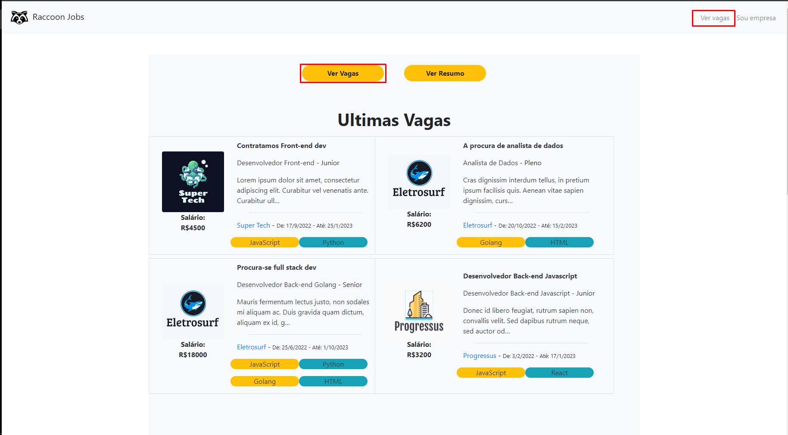

Acessando a página "Lista de Vagas"

|ID    | Descrição do teste  |  Descrição do resultado | Gravidade|
|------|---------------------|-------------------------|----------|
|CT-?   RF-07| Verificar se a barra de pesquisa encontra vagas validas corretamente.| A barra de pesquisa funcionou perfeitamente retornando resultado esperados do teste |Sucesso | 

Objetivo: Testar barra de busca; 

Pesquisar: front 

Saída esperada: Vaga de desenvolvedor Front End pela Super Tech

|ID    | Descrição do teste  |  Descrição do resultado | Gravidade|
|------|---------------------|-------------------------|----------|
|CT-?   RF-07|Verificar se a barra de pesquisa não exibe resultados ao efetuar uma pesquisa de uma vaga inexistente. | A barra de pesquisa funcionou perfeitamente retornando uma lista vazia, resultado esperado do teste |Sucesso | 

Objetivo: Testar barra de busca

Pesquisar : psicologo 

Saída esperada: Uma lista vazia com a seguinte mensagem: Não existem vagas no momento, tente alterar seus filtros.

|ID    | Descrição do teste  |  Descrição do resultado | Gravidade|
|------|---------------------|-------------------------|----------|
|CT-?   RF-07| Verificar se o filtro por categoria está encontra vagas validas corretamente. | O filtro por categoria funcionou perfeitamente retornando resultado esperados do teste |Sucesso | 

Objetivo: Testar filtro de categoria 

Filtrar por: React 

Saída esperada : Vaga de desenvolvedor back-end pela Progressus

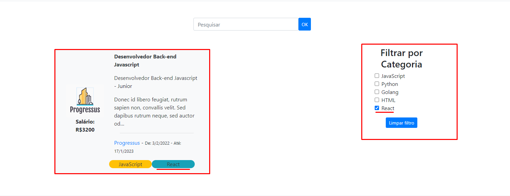

|ID    | Descrição do teste  |  Descrição do resultado | Gravidade|
|------|---------------------|-------------------------|----------|
|CT-?   RF-005| Deve ser possível chegar a pagina de criação de vaga atráves da aplicação | A pagina foi exibida adequadamente e dinamicamente |  Sucesso |

1. Acessar a pagina inicial e clicar em "Sou Empresa"

2. Efetuar login

3. Clicar em Nova Vaga

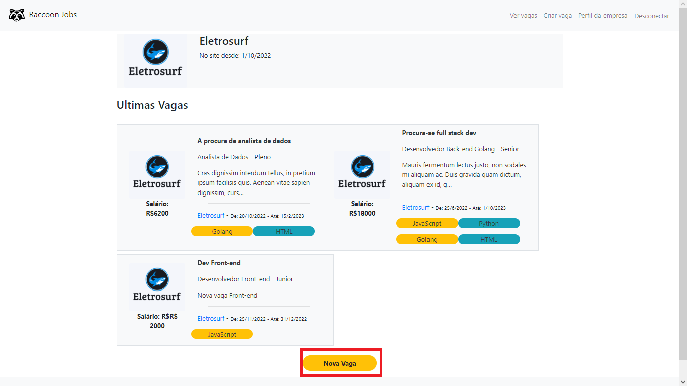

|ID    | Descrição do teste  |  Descrição do resultado | Gravidade|
|------|---------------------|-------------------------|----------|
|CT-?   RF-005| Deve ser possível criar uma nova vaga seguindo todo o processo com informações validas | A vaga foi criada corretamente e exibida de acordo |  Sucesso |

1. Acessar a pagina inicial e clicar em "Sou Empresa"

2. Efetuar login

3. Clicar em Nova Vaga

4. Preencher formulario com as informações:
& 
5. Clicar em Criar Vaga

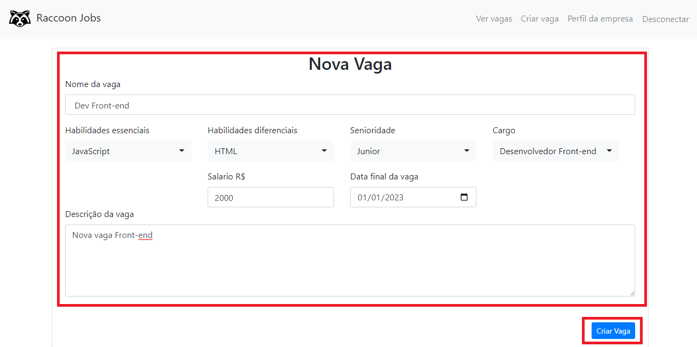
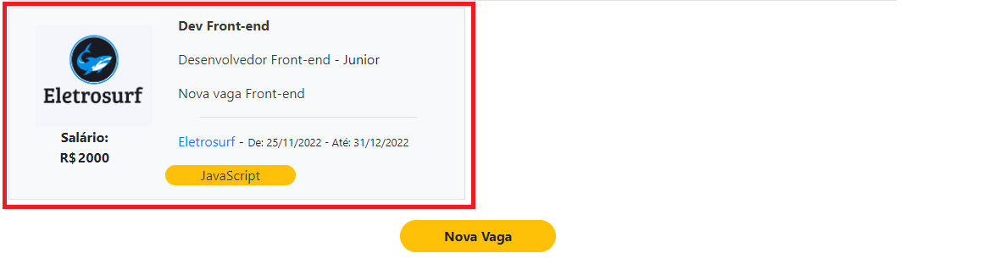

|ID    | Descrição do teste  |  Descrição do resultado | Gravidade|
|------|---------------------|-------------------------|----------|
|CT-?   RF-005| Deve ser impossível criar uma nova vaga seguindo todo o processo com todas as informações em branco | Um erro foi exibido conforme o esperado e informando os campos que devem ser preenchidos |  Sucesso |

1. Acessar a pagina inicial e clicar em "Sou Empresa"

2. Efetuar login

3. Clicar em Nova Vaga

4. Clicar em Criar Vaga

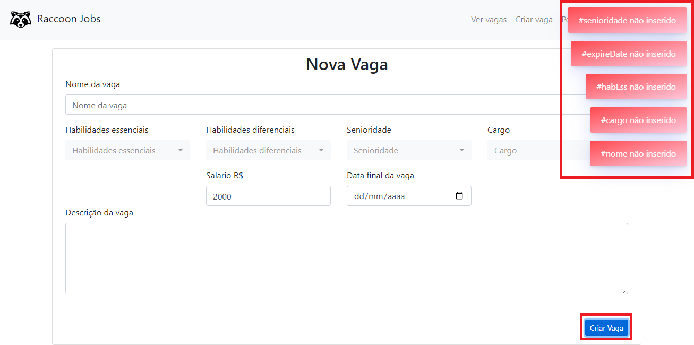

|ID    | Descrição do teste  |  Descrição do resultado | Gravidade|
|------|---------------------|-------------------------|----------|
|CT-?   RF-013|Deve ser possível acessar a pagina de login seguindo todo o processo pela aplicação | A pagina foi exibida adequadamente e dinamicamente |  Sucesso |

1. Acessar a pagina inicial
&
2. Clicar em "Sou Empresa"

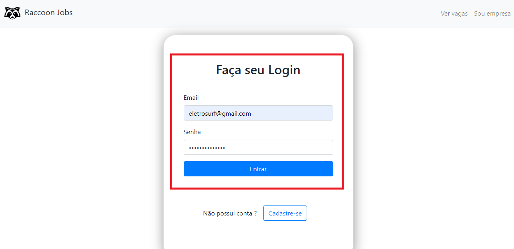

|ID    | Descrição do teste  |  Descrição do resultado | Gravidade|
|------|---------------------|-------------------------|----------|
|CT-?   RF-013| Deve ser possível acessar a pagina de registro seguindo todo o processo pela aplicação | A pagina foi exibida adequadamente e dinamicamente |  Sucesso |

1. Acessar a pagina inicial
&
2. Clicar em "Sou Empresa"

3. Clicar em Cadastre-se

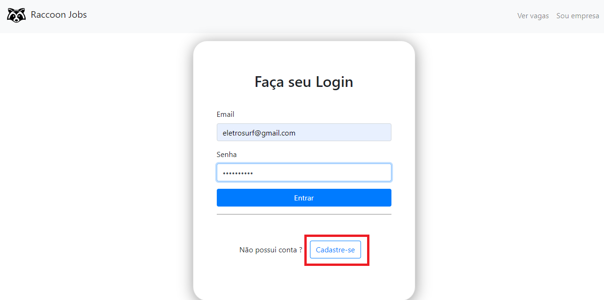
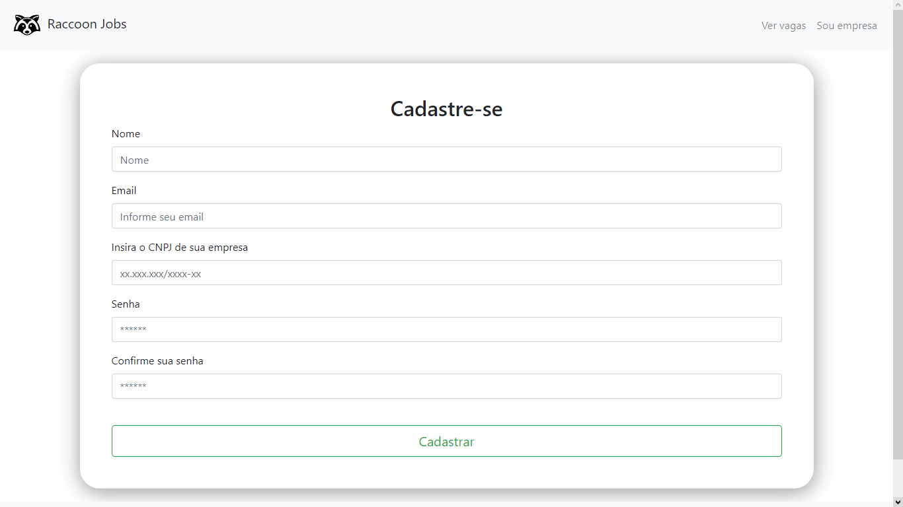

|ID    | Descrição do teste  |  Descrição do resultado | Gravidade|
|------|---------------------|-------------------------|----------|
|CT-?   RF-013| Deve ser possível se registrar com sucesso seguindo os passos e inserindo informações validas | O cadastro foi efetuado com sucesso e pagina da empresa exibida |  Sucesso |

1. Acessar a pagina inicial
&
2. Clicar em "Sou Empresa"

3. Clicar em Cadastre-se

4. Inserir as informações
&
5. Clicar em Cadastrar
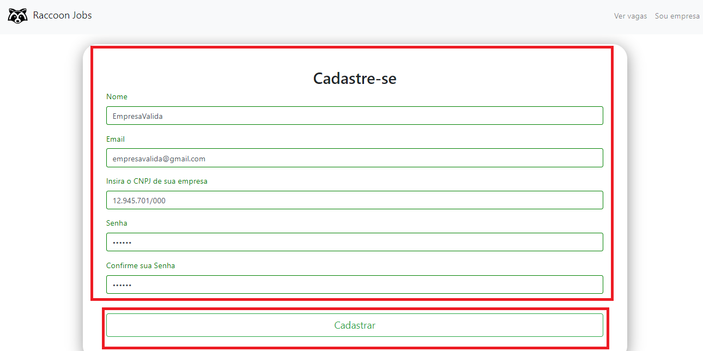

6. Efetuar login com informações registradas
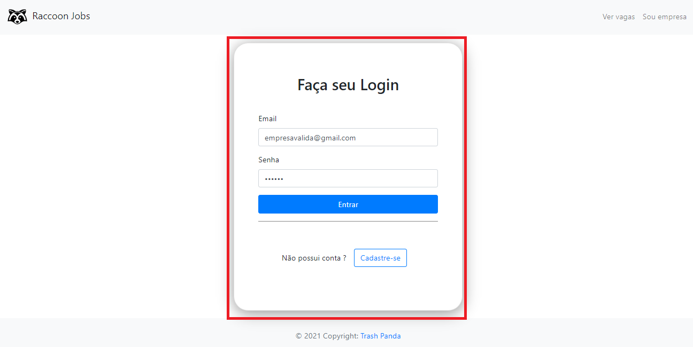
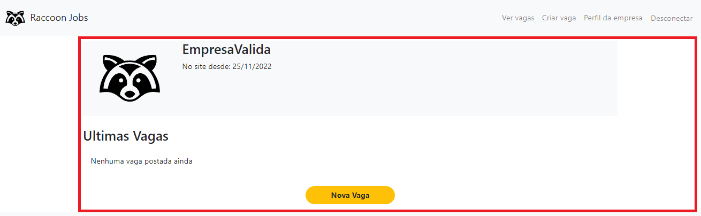

|ID    | Descrição do teste  |  Descrição do resultado | Gravidade|
|------|---------------------|-------------------------|----------|
|CT-?   RF-013| Deve ser impossível se registrar com todos os campos em branco | Um erro foi exibido como esperado e não foi possível efetuar o cadastro |  Sucesso |

1. Acessar a pagina inicial
&
2. Clicar em "Sou Empresa"

3. Clicar em Cadastre-se

4. Clicar em Cadastrar
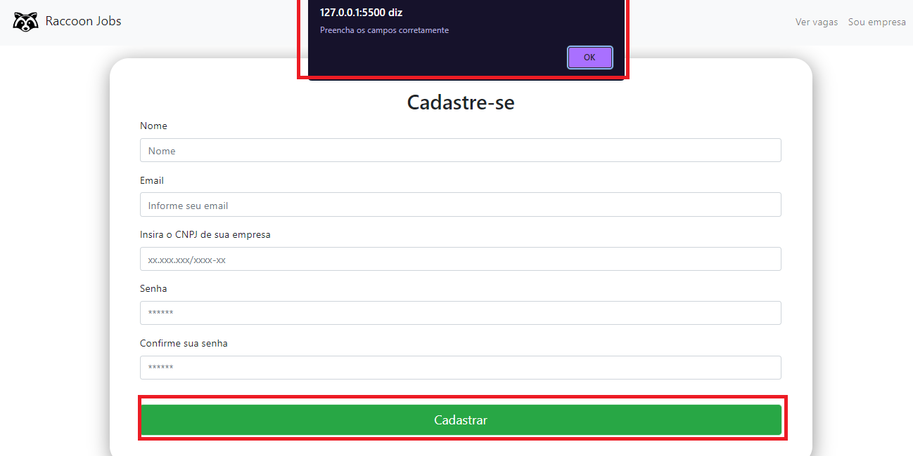

|ID    | Descrição do teste  |  Descrição do resultado | Gravidade|
|------|---------------------|-------------------------|----------|
|CT-?   RF-013| Deve ser possível efetuar login seguindo os passos e inserindo informações validas | O login foi efetuado com sucesso e pagina da empresa foi exibida de acordo |  Sucesso |

1. Acessar a pagina inicial
&
2. Clicar em "Sou Empresa"

3. Inserir as informações de acordo:
&
4. Clicar em Entrar

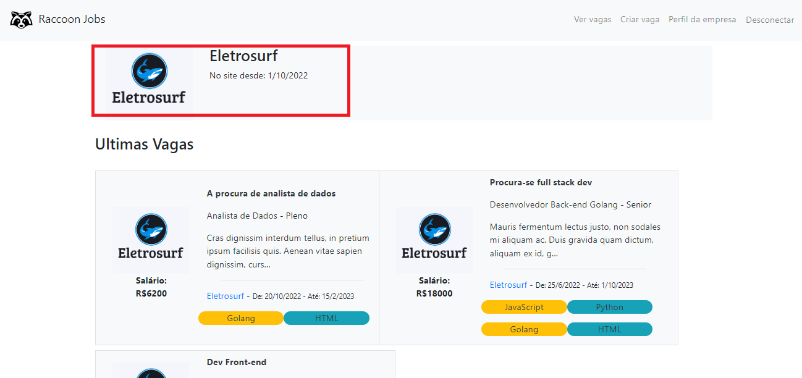

|ID    | Descrição do teste  |  Descrição do resultado | Gravidade|
|------|---------------------|-------------------------|----------|
|CT-?   RF-013| Deve ser impossível efetuar login com todos os campos em branco | Um erro foi exibido como o esperado e não foi possível efetuar login | Sucesso |

1. Acessar a pagina inicial
&
2. Clicar em "Sou Empresa"

3. Clicar em Entrar
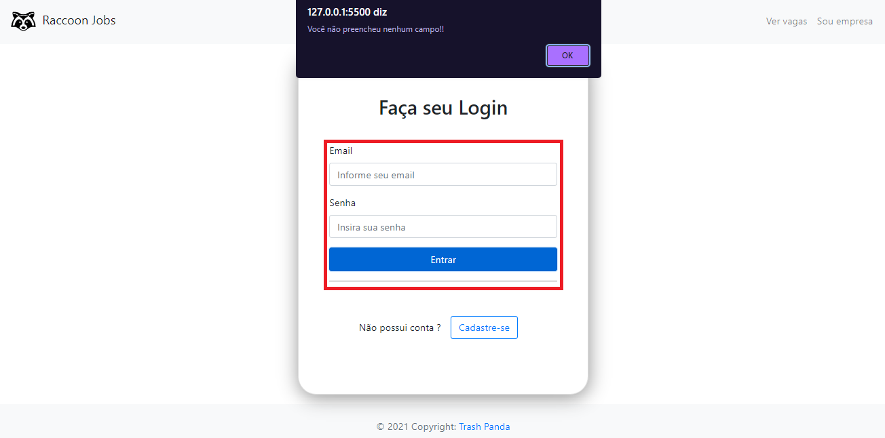

|ID    | Descrição do teste  |  Descrição do resultado | Gravidade|
|------|---------------------|-------------------------|----------|
|CT-?   RF-013| Deve ser impossível efetuar login seguindo os passos e inserindo um email valido e uma senha invalida | Um erro foi exibido como o esperado e não foi possível efetuar login | Sucesso |

1. Acessar a pagina inicial
&
2. Clicar em "Sou Empresa"

3. Inserir as informações de acordo:
&
4. Clicar em Entrar
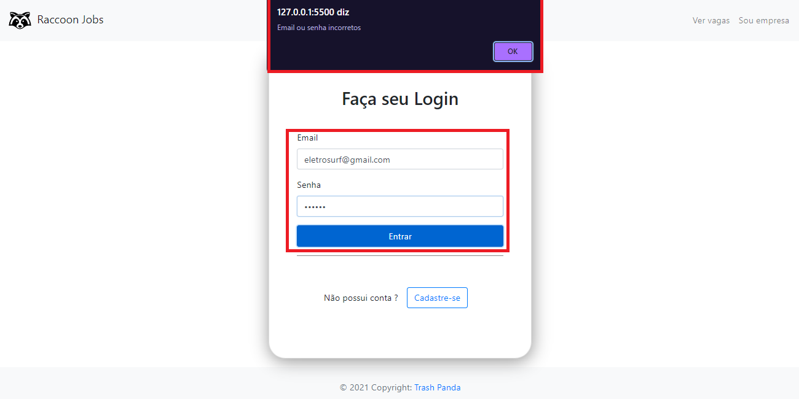

|ID    | Descrição do teste  |  Descrição do resultado | Gravidade|
|------|---------------------|-------------------------|----------|
|CT-?   RF-013| Deve ser impossível efetuar login seguindo os passos e inserindo um email invalido e uma senha valida | Um erro foi exibido como o esperado e não foi possível efetuar login | Sucesso |

1. Acessar a pagina inicial
&
2. Clicar em "Sou Empresa"

3. Inserir as informações de acordo:
&
4. Clicar em Entrar
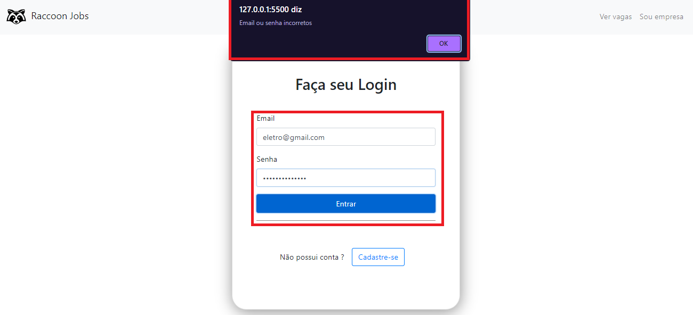

# Testes de Campos completos

Os passos genéricos seram abordados nos testes de ponta a ponta, portanto essas etapas serão puladas para melhor compreensão dos testes.

|ID    | Descrição do teste  |  Descrição do resultado | Gravidade|
|------|---------------------|-------------------------|----------|
|CT-?   RF-05| Deve ser possível inserir um nome na vaga com quaisquer caracteres, números ou caracteres especiais. | O redirecionamento para o perfil aconteceu e a vaga foi criada com sucesso com o nome: aaAA11!@#$%¨¨&*()_{}[] | Sucesso | 

1. Escrever em "Nome da vaga": aaAA11!@#$%¨¨&*()_{}[]
2. Completar outros campos do formulario com informações validas
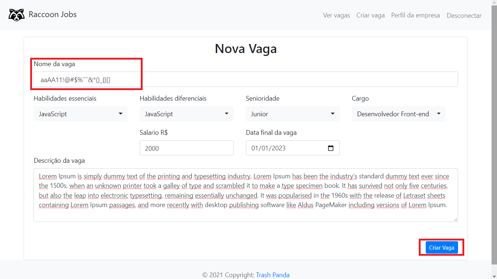

3. Clicar em Criar Vaga

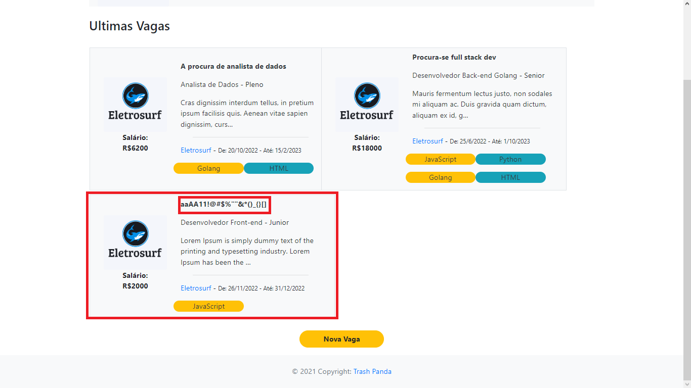

|ID    | Descrição do teste  |  Descrição do resultado | Gravidade|
|------|---------------------|-------------------------|----------|
|CT-?   RF-05| Deve ser impossível criar um vaga sem nome | Um erro foi exibido como esperado e não foi possível criar a vaga | Sucesso | 

1. Manter campo "Nome da vaga" em branco
2. Completar outros campos do formulario com informações validas
3. Clicar em Criar Vaga
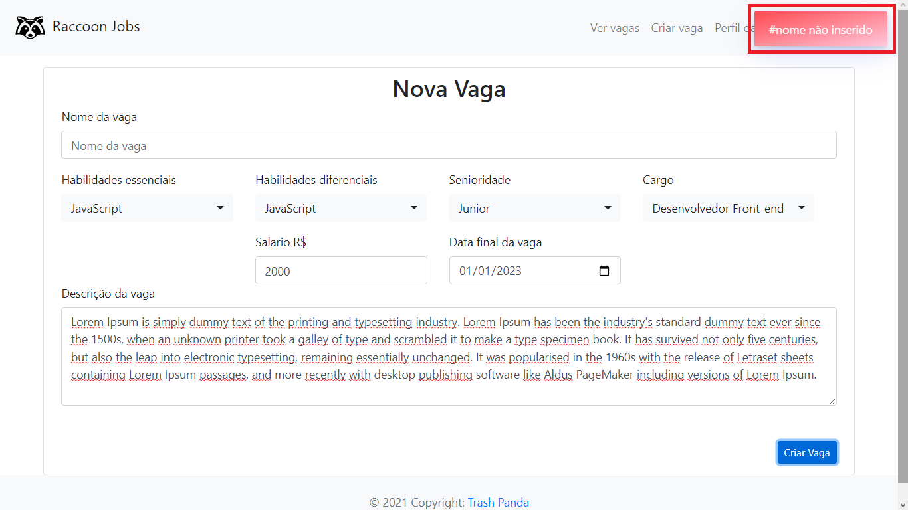

|ID    | Descrição do teste  |  Descrição do resultado | Gravidade|
|------|---------------------|-------------------------|----------|
|CT-?   RF-05| Deve ser possível selecionar uma ou mais habilidades essenciais| O redirecionamento para o perfil aconteceu e a vaga foi criada com sucesso com as habilidades essenciais: Javascript, HTML, REACT | Sucesso | 

1. No campo "Habilidades essenciais" selecionar: [JavaScript, HTML, REACT]
2. Completar outros campos do formulario com informações validas
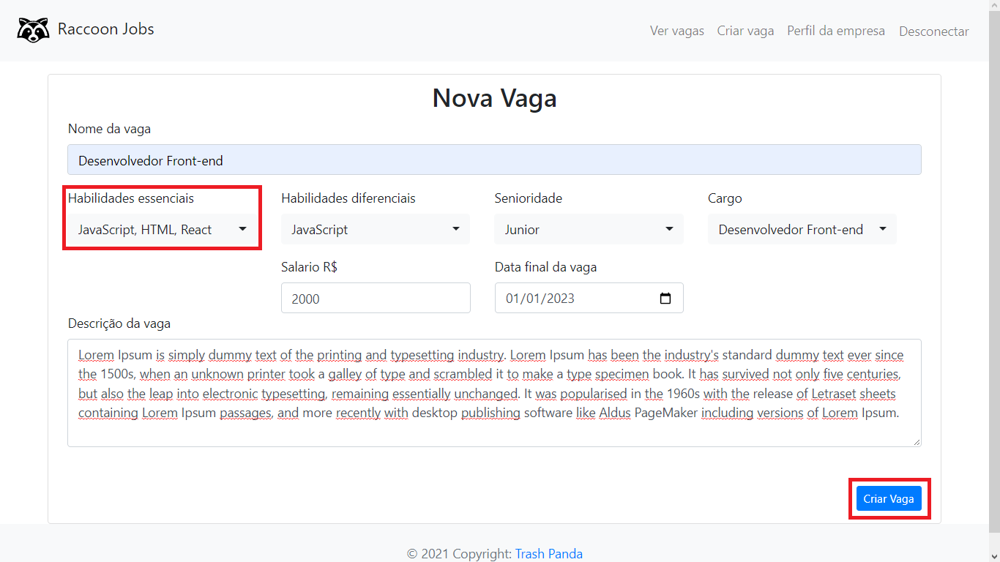

3. Clicar em Criar Vaga
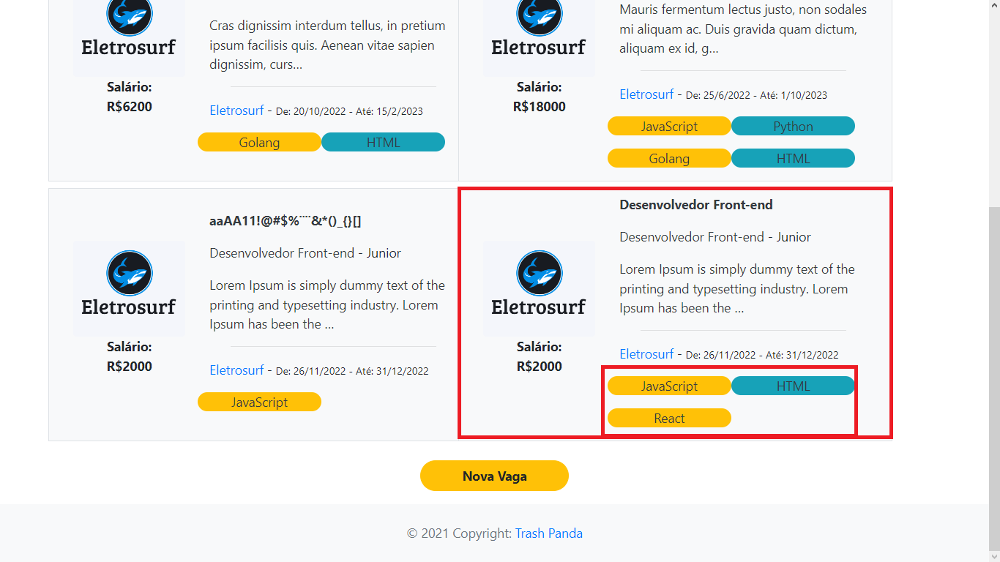

|ID    | Descrição do teste  |  Descrição do resultado | Gravidade|
|------|---------------------|-------------------------|----------|
|CT-?   RF-05| Deve ser impossível criar uma vaga sem habilidades essenciais| Um erro foi exibido como esperado e não foi possível criar a vaga | Sucesso | 

1. Manter campo "Habilidades essenciais" em branco
2. Completar outros campos do formulario com informações validas
3. Clicar em Criar Vaga
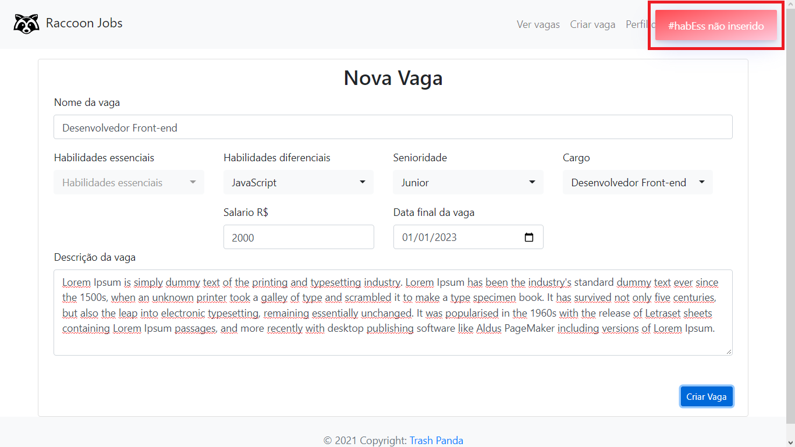

|ID    | Descrição do teste  |  Descrição do resultado | Gravidade|
|------|---------------------|-------------------------|----------|
|CT-?   RF-05| Deve ser possível selecionar uma ou mais habilidades diferenciais| O redirecionamento para o perfil aconteceu e a vaga foi criada com sucesso com as habilidades diferenciais: Golang e Python | Sucesso | 

1. No campo "Habilidades diferenciais" selecionar: [Golang, Python]
2. Completar outros campos do formulario com informações validas
3. Clicar em Criar Vaga
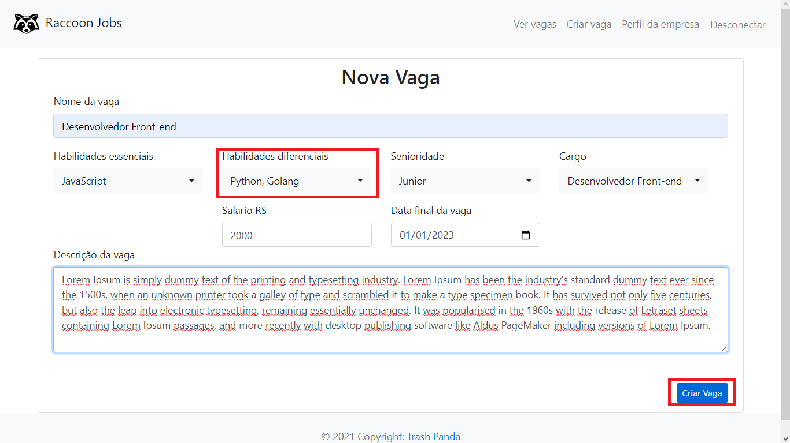
4. Clicar no nome da vaga
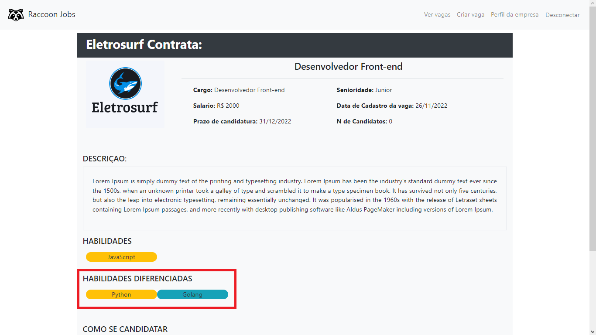

|ID    | Descrição do teste  |  Descrição do resultado | Gravidade|
|------|---------------------|-------------------------|----------|
|CT-?   RF-05| Deve ser possível criar uma vaga sem habilidades diferenciais| O redirecionamento para o perfil aconteceu e a vaga foi criada com sucesso sem habilidades difereiciais | Sucesso |

1. No campo "Habilidades diferenciais" manter em branco
2. Completar outros campos do formulario com informações validas
3. Clicar em Criar Vaga
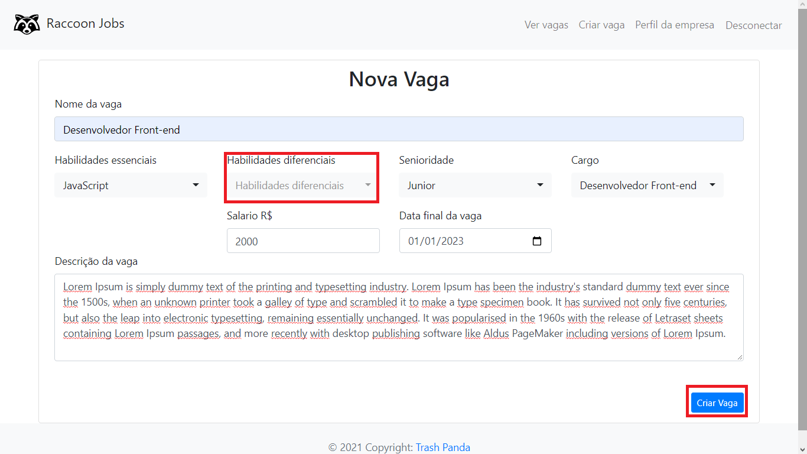
4. Clicar no nome da vaga
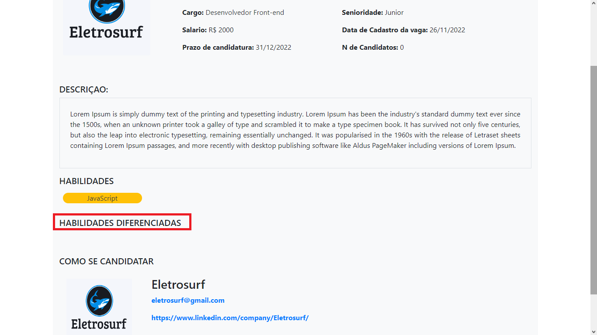

|ID    | Descrição do teste  |  Descrição do resultado | Gravidade|
|------|---------------------|-------------------------|----------|
|CT-?   RF-05| Deve ser possível selecionar uma senioridade | O redirecionamento para o perfil aconteceu e a vaga foi criada com sucesso | Sucesso | 

1. No campo "Senioridade" selecionar: "Pleno"
2. Completar outros campos do formulario com informações validas
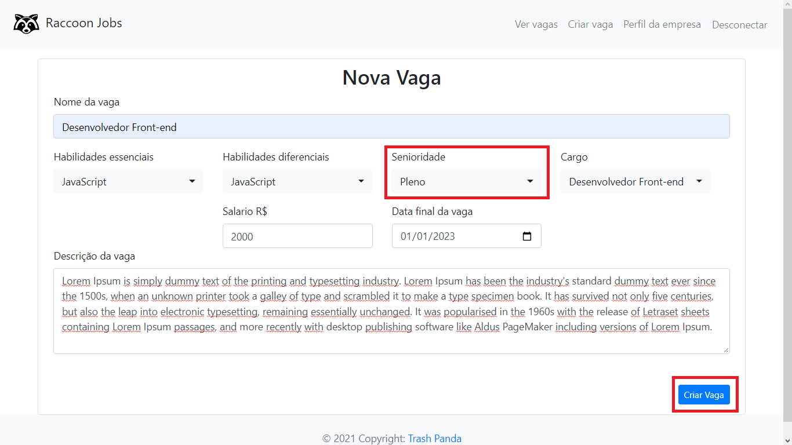

3. Clicar em Criar Vaga
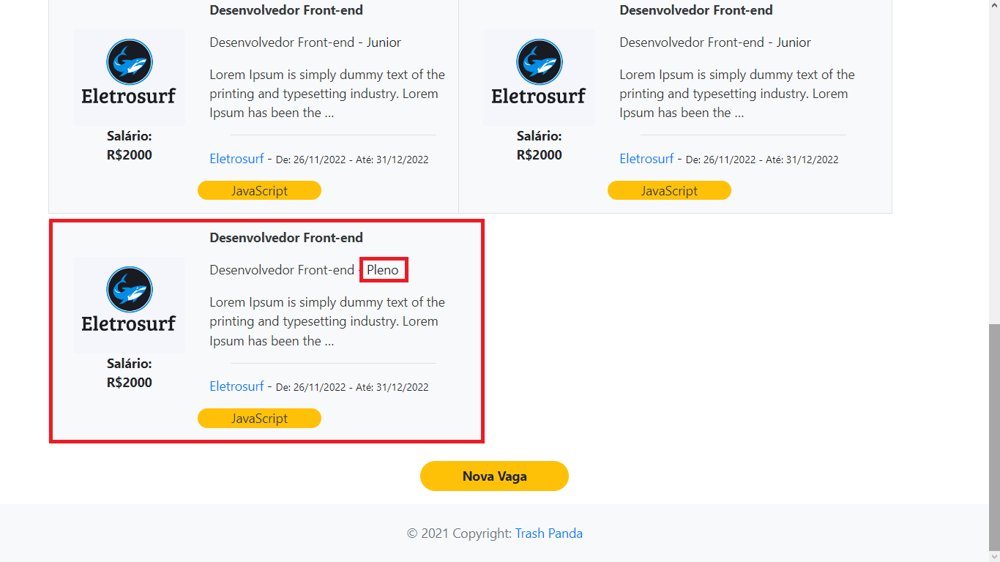

|ID    | Descrição do teste  |  Descrição do resultado | Gravidade|
|------|---------------------|-------------------------|----------|
|CT-?   RF-05| Deve ser impossível criar uma vaga sem senioridade |  Um erro foi exibido como esperado e não foi possível criar a vaga | Sucesso | 

1. No campo "Senioridade" deixar em branco
2. Completar outros campos do formulario com informações validas
3. Clicar em Criar Vaga
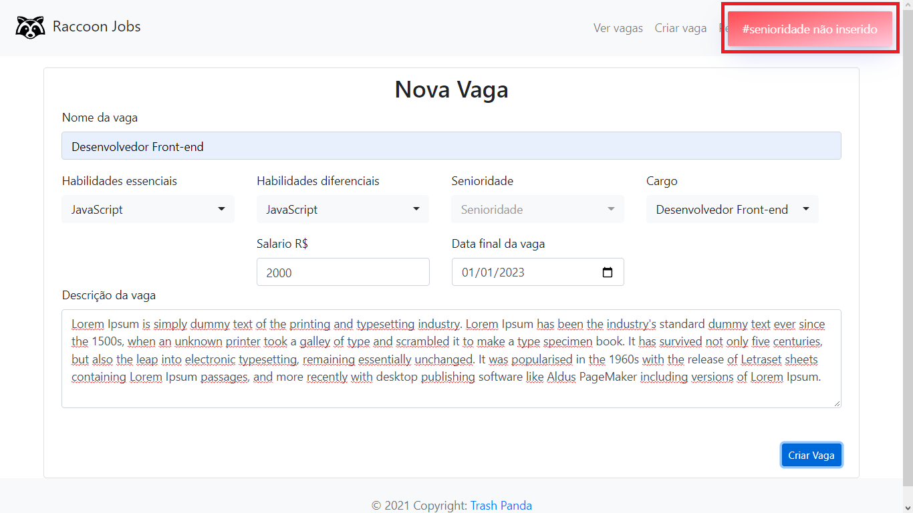

|ID    | Descrição do teste  |  Descrição do resultado | Gravidade|
|------|---------------------|-------------------------|----------|
|CT-?   RF-05| Deve ser possível selecionar um cargo | O redirecionamento para o perfil aconteceu e a vaga foi criada com sucesso | Sucesso |

1. No campo "Cargo" selecionar: "Desenvolvedor Front-end"
2. Completar outros campos do formulario com informações validas
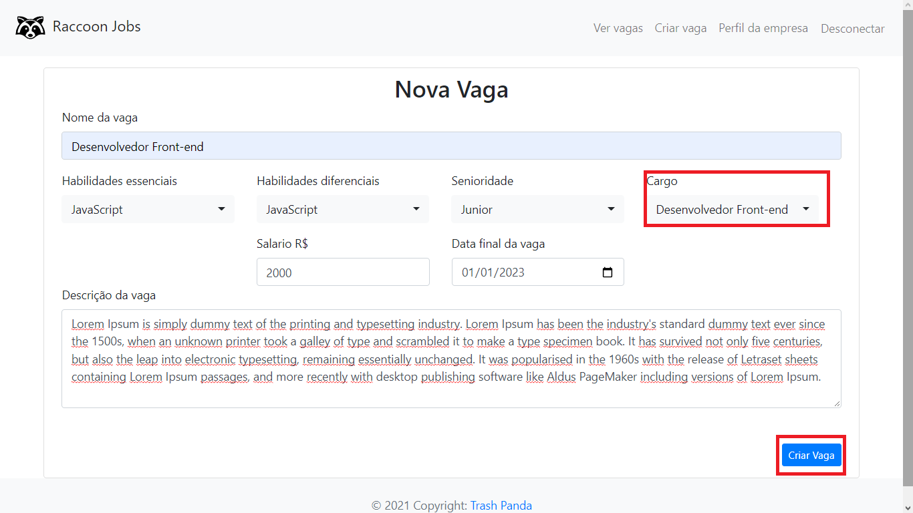
3. Clicar em Criar Vaga
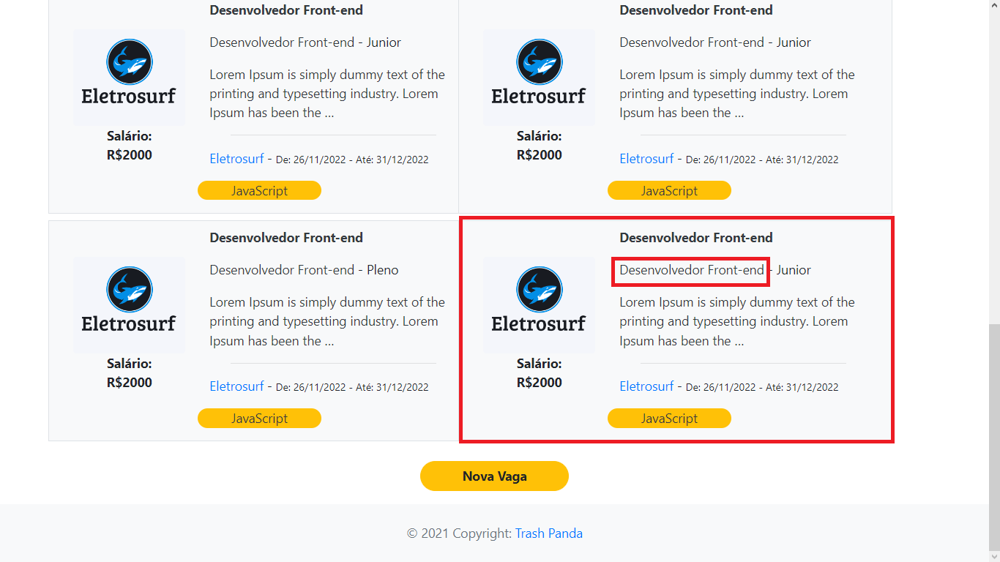

|ID    | Descrição do teste  |  Descrição do resultado | Gravidade|
|------|---------------------|-------------------------|----------|
|CT-?   RF-05| Deve ser impossível criar uma vaga sem cargo | Um erro foi exibido como esperado e não foi possível criar a vaga | Sucesso | 

1. No campo "Cargo" deixar em branco
2. Completar outros campos do formulario com informações validas
3. Clicar em Criar Vaga
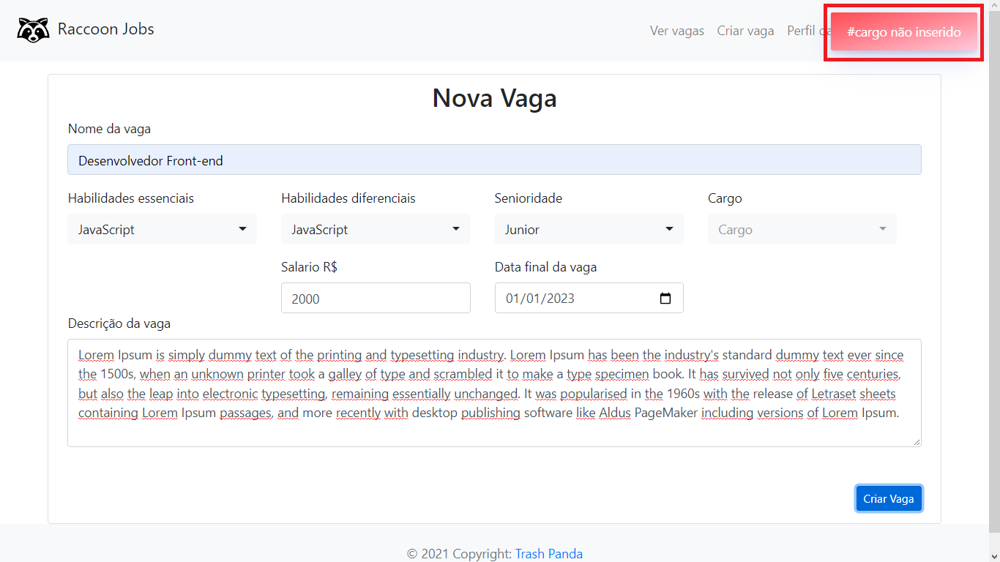

|ID    | Descrição do teste  |  Descrição do resultado | Gravidade|
|------|---------------------|-------------------------|----------|
|CT-?   RF-05| Deve ser possível definir um salario para a vaga | O redirecionamento para o perfil aconteceu e a vaga foi criada com sucesso | Sucesso |

1. No campo "Salario" digitar: 9500
2. Completar outros campos do formulario com informações validas
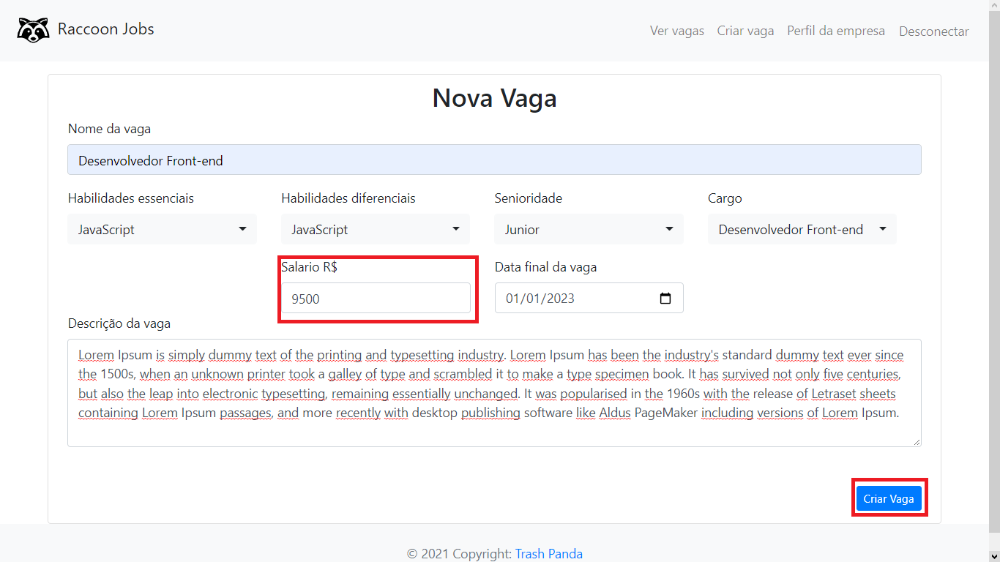
3. Clicar em Criar Vaga
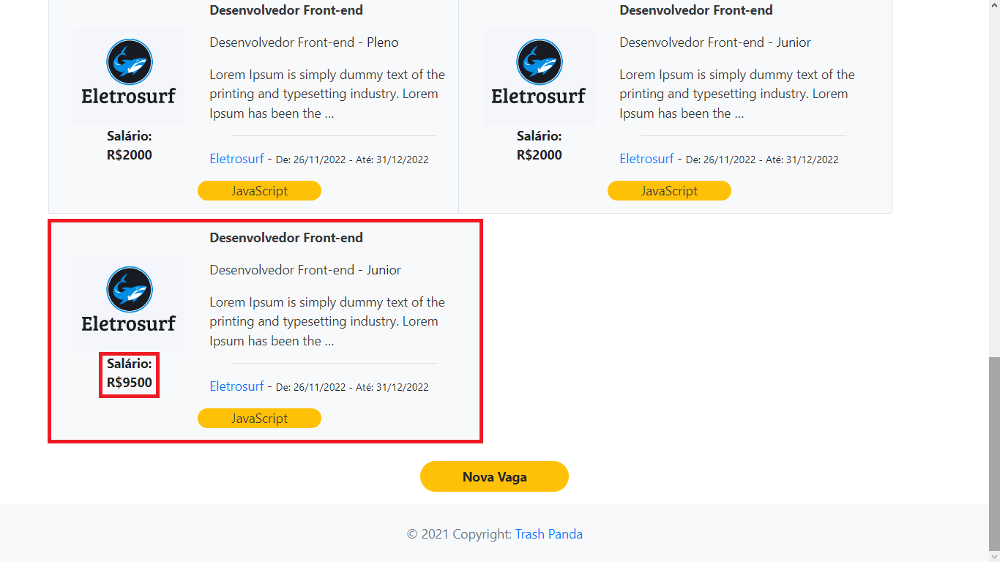

|ID    | Descrição do teste  |  Descrição do resultado | Gravidade|
|------|---------------------|-------------------------|----------|
|CT-?   RF-05| Deve ser impossível criar uma vaga sem salario | Um erro foi exibido como esperado e não foi possível criar a vaga | Sucesso | 

1. No campo "Salario" deixar em branco
2. Completar outros campos do formulario com informações validas
3. Clicar em Criar Vaga
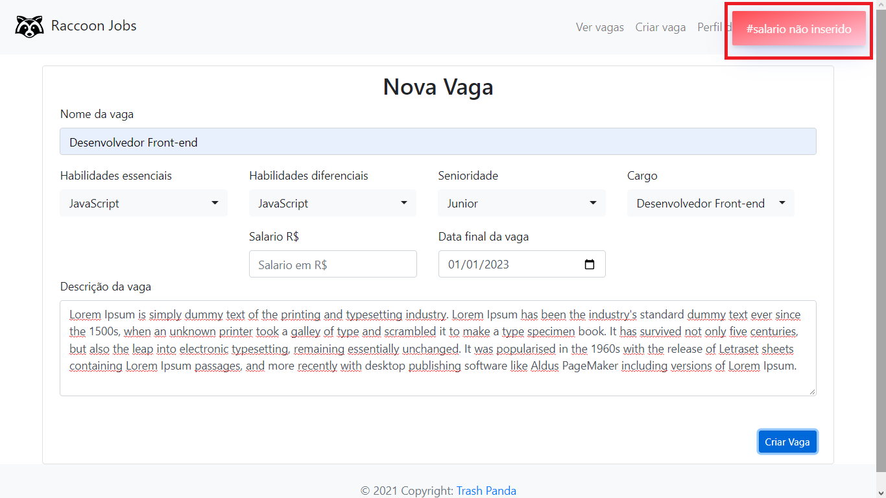

|ID    | Descrição do teste  |  Descrição do resultado | Gravidade|
|------|---------------------|-------------------------|----------|
|CT-?   RF-05| Deve ser possível definir um salario para a vaga | O redirecionamento para o perfil aconteceu e a vaga foi criada com sucesso | Sucesso |

1. No campo "Data final da vaga" selecionar: 10/10/2023
2. Completar outros campos do formulario com informações validas

3. Clicar em Criar Vaga
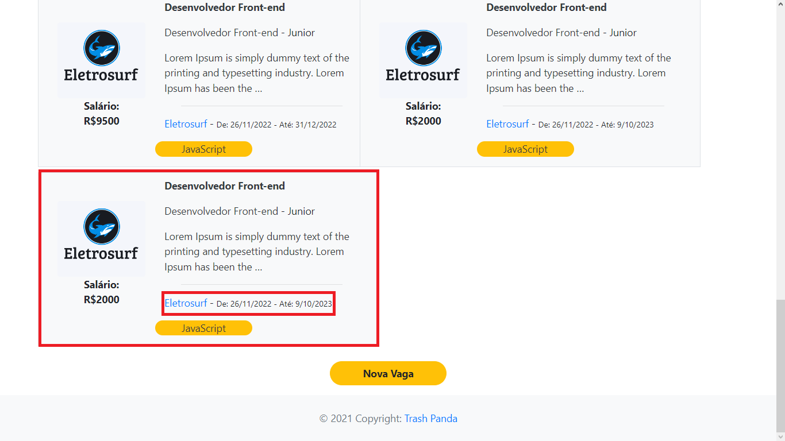

|ID    | Descrição do teste  |  Descrição do resultado | Gravidade|
|------|---------------------|-------------------------|----------|
|CT-?   RF-05| Deve ser impossível criar uma vaga com data para expiração da vaga anterior ao dia atual | A vaga foi criada indevidamente, porém não aparece em nenhuma lista ou pagina | Baixa | 

1. No campo "Data final da vaga" selecionar: 01/01/2022
2. Completar outros campos do formulario com informações validas
3. Clicar em Criar Vaga
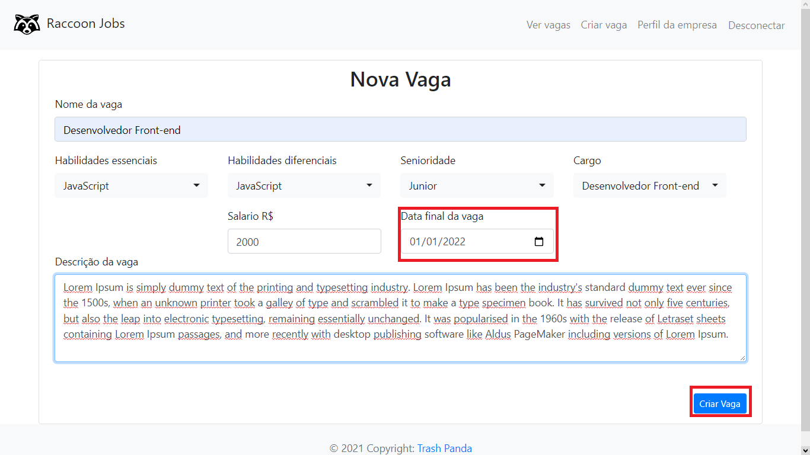

|ID    | Descrição do teste  |  Descrição do resultado | Gravidade|
|------|---------------------|-------------------------|----------|
|CT-?   RF-05| Deve ser impossível criar uma vaga sem data de expiração | Um erro foi exibido como esperado e não foi possível criar a vaga | Sucesso | 

1. No campo "Data final da vaga" manter em branco
2. Completar outros campos do formulario com informações validas
3. Clicar em Criar Vaga
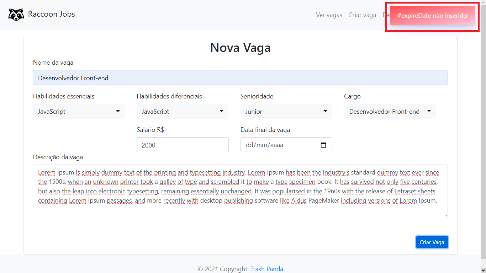

|ID    | Descrição do teste  |  Descrição do resultado | Gravidade|
|------|---------------------|-------------------------|----------|
|CT-?   RF-05| Deve ser possível definir uma descrição para a vaga com quaisquer caracteres, numeros ou caracteres especiais | O redirecionamento para o perfil aconteceu e a vaga foi criada com sucesso | Sucesso |

1. Escrever em "Descrição da vaga": aaAA11!@#$%¨¨&*()_{}[]
2. Completar outros campos do formulario com informações validas
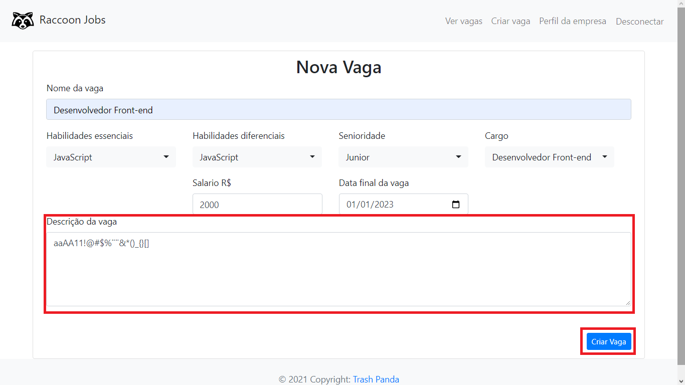
3. Clicar em Criar Vaga
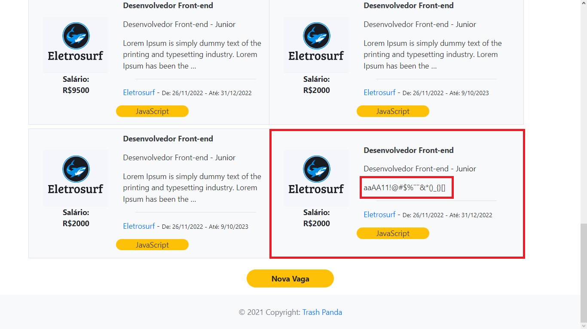

|ID    | Descrição do teste  |  Descrição do resultado | Gravidade|
|------|---------------------|-------------------------|----------|
|CT-?   RF-05| Deve ser possível criar uma vaga sem descrição | O redirecionamento para o perfil aconteceu e a vaga foi criada com sucesso | Sucesso |

1. Em "Descrição da vaga" manter em branco
2. Completar outros campos do formulario com informações validas
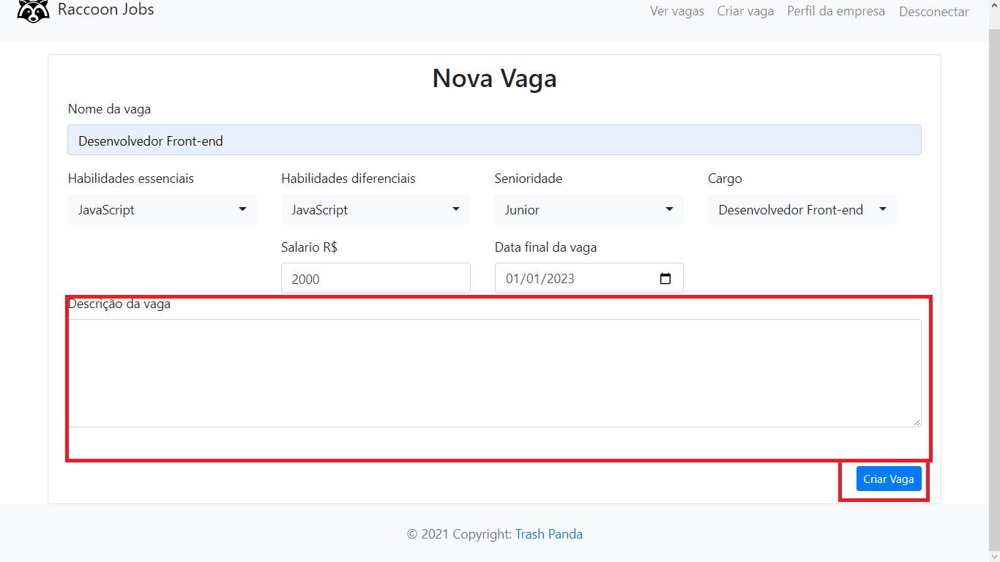
3. Clicar em Criar Vaga
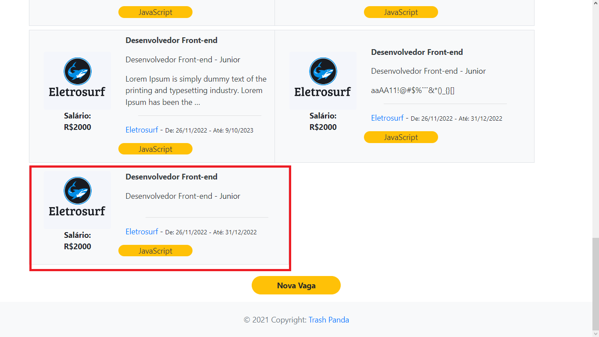

|ID    | Descrição do teste  |  Descrição do resultado | Gravidade|
|------|---------------------|-------------------------|----------|
|CT-?   RF-05| Ao criar uma vaga, todas as informações digitadas devem estar de acordo com os valores inseridos no formulario | Todas as informações estavam de acordo com o criado | Sucesso |

1. Completar campos com:
<ol><li>Nome da vaga> TESTE1</li> <li>Habiilidades essenciais: HTML</li><li>Habilidades diferenciais: HTML</li><li>Senioridade: Senior</li><li>Cargo:Analista de Dados</li> <li>Salario: 11500</li><li>Data final da vaga: 05/05/2025</li> <li>Descrição da vaga: Testando campos</li></ol>

2. Clicar em Criar Vaga

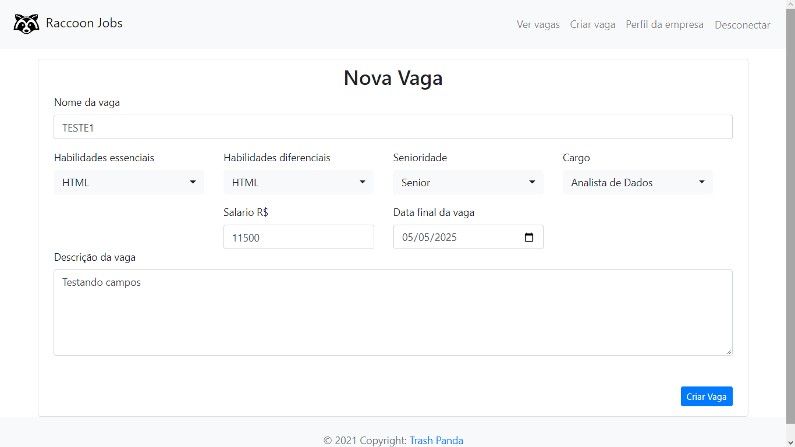

3. Clicar no nome da vaga

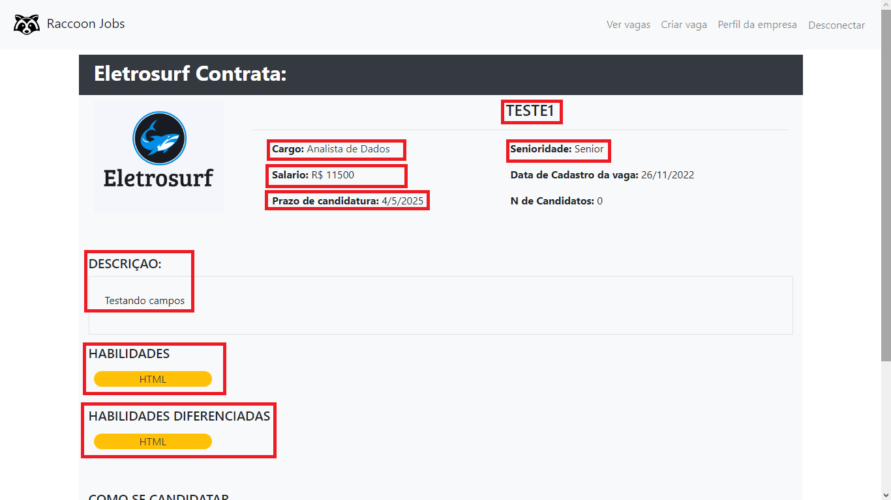

|ID    | Descrição do teste  |  Descrição do resultado | Gravidade|
|------|---------------------|-------------------------|----------|
|CT-?   RF-05|Ao criar uma vaga, todas as informações digitadas devem estar de acordo com os valores inseridos no formulario e devem ser verificadas através de javascript | fixme | fixme |

//Testes e imagens aqui.

|ID    | Descrição do teste  |  Descrição do resultado | Gravidade|
|------|---------------------|-------------------------|----------|
|CT-?   RF-013| Deve ser possível inserir um nome para a empresa com quaisquer caracteres, números ou caracteres especiais. | O cadastro foi efetuado com sucesso | Sucesso |

1. Escrever em "Nome da Empresa": EmpresaTest123!@#$%¨¨&*()_{}[]

2. Completar outros campos do formulario com informações validas

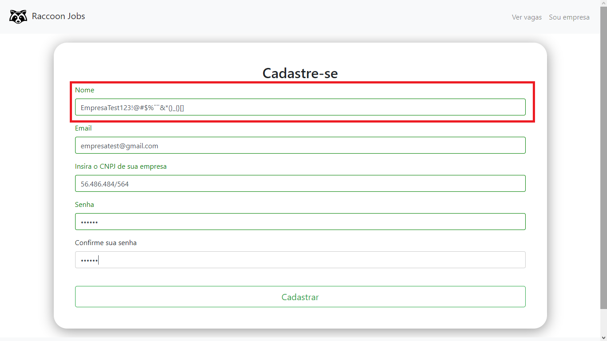

3. Efetuar login com informações cadastradas

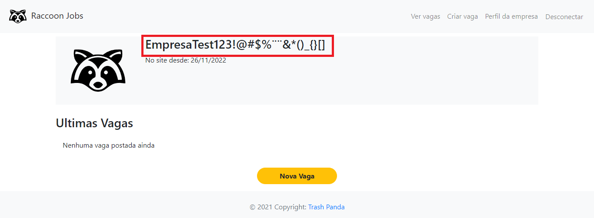

|ID    | Descrição do teste  |  Descrição do resultado | Gravidade|
|------|---------------------|-------------------------|----------|
|CT-?   RF-013| Deve ser impossível se cadastrar sem inserir o nome da empresa | Um erro aconteceu como o esperado  | Sucesso |

1. Em "Nome da Empresa" manter em branco
2. Completar outros campos do formulario com informações validas
3. Clicar em Cadastrar

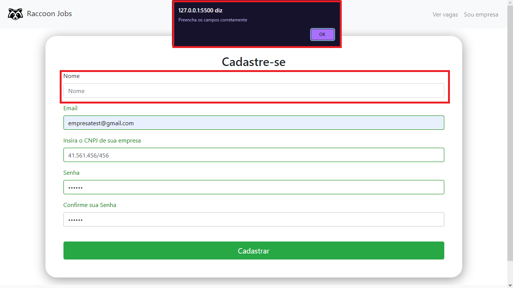

|ID    | Descrição do teste  |  Descrição do resultado | Gravidade|
|------|---------------------|-------------------------|----------|
|CT-?   RF-013| 	Deve ser possível inserir um email valido para a empresa | O cadastro foi efetuado com sucesso | Sucesso |

1. Escrever em "Email": empresatest@gmail.com

2. Completar outros campos do formulario com informações validas

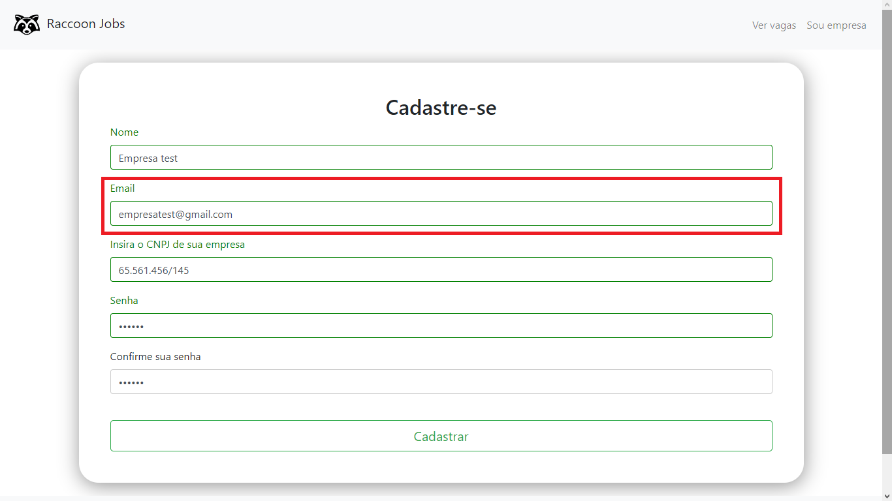

3. Efetuar login com informações cadastradas

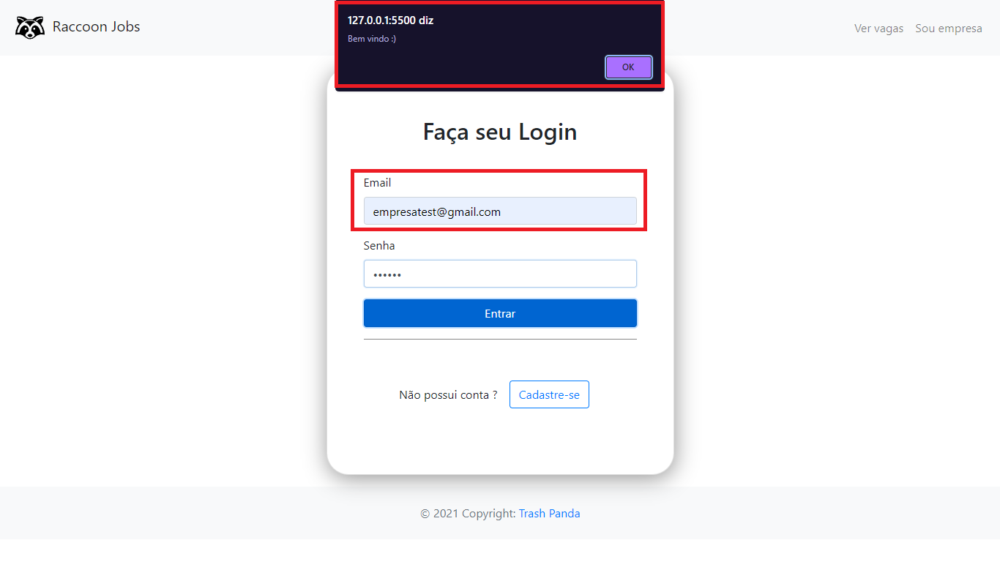
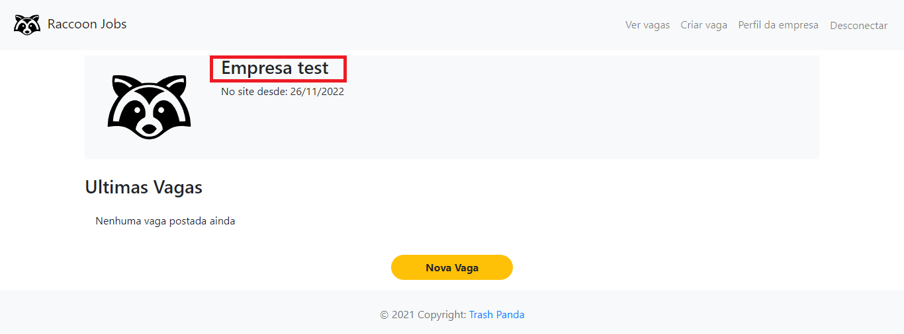

|ID    | Descrição do teste  |  Descrição do resultado | Gravidade|
|------|---------------------|-------------------------|----------|
|CT-?   RF-013| Deve ser impossível inserir um email invalido para a empresa | Um erro aconteceu como o esperado  | Sucesso |

1. Escrever em "Email": empresatest!!
2. Completar outros campos do formulario com informações validas
3. Clicar em Cadastrar

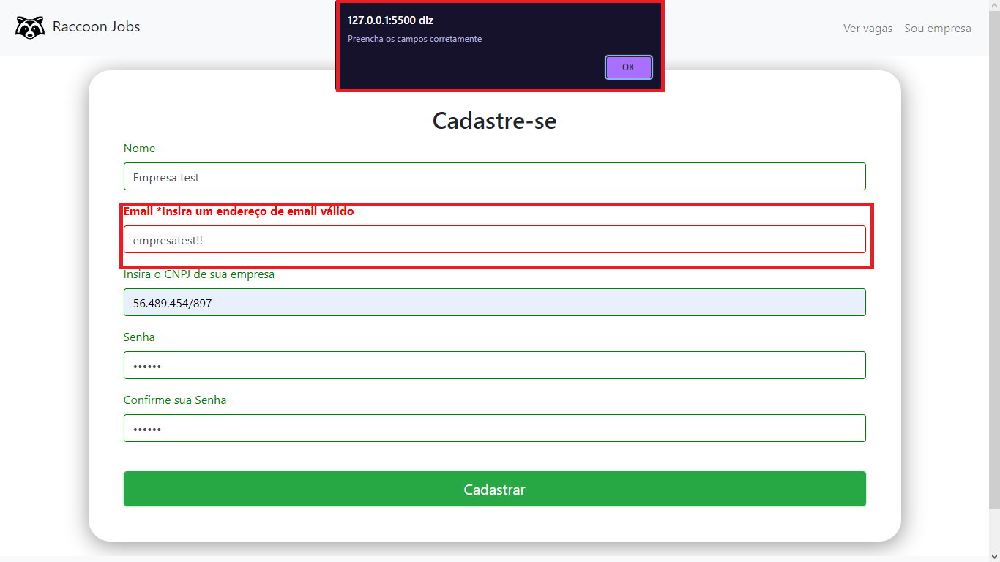

|ID    | Descrição do teste  |  Descrição do resultado | Gravidade|
|------|---------------------|-------------------------|----------|
|CT-?   RF-013| Deve ser possível inserir um CNPJ valido para a empresa | O cadastro foi efetuado com sucesso | Sucesso |

1. Escrever em "CNPJ": 12.945.701/0001-82

2. Completar outros campos do formulario com informações validas

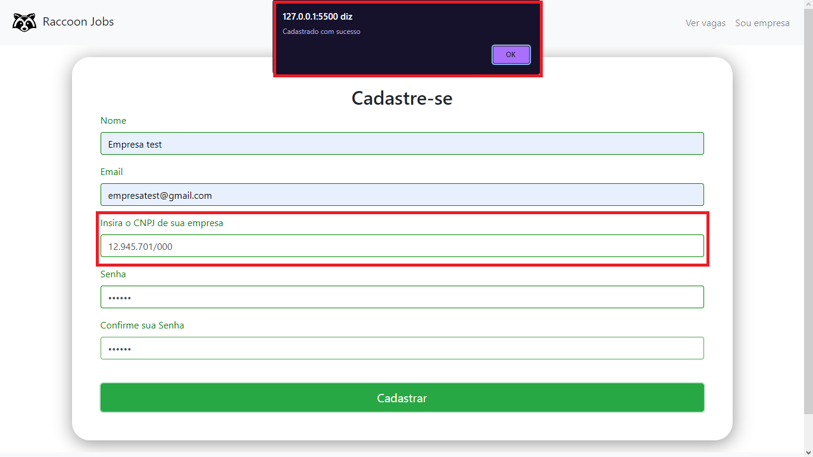
                                                             cpnjValida.png

3. Efetuar login com informações cadastradas

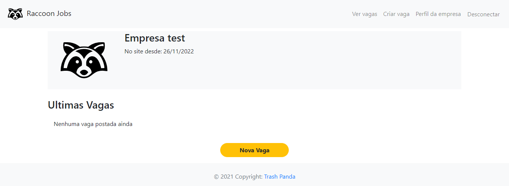

|ID    | Descrição do teste  |  Descrição do resultado | Gravidade|
|------|---------------------|-------------------------|----------|
|CT-?   RF-013| Deve ser impossível inserir um CNPJ invalido para a empresa | Um erro aconteceu como o esperado  | Sucesso |

1. Escrever em "CNPJ": 12.945.701
2. Completar outros campos do formulario com informações validas
3. Clicar em Cadastrar

|ID    | Descrição do teste  |  Descrição do resultado | Gravidade|
|------|---------------------|-------------------------|----------|
|CT-?   RF-013| Deve ser impossível se cadastrar sem inserir um CNPJ | Um erro aconteceu como o esperado  | Sucesso |

1. Em "CNPJ" manter em branco
2. Completar outros campos do formulario com informações validas
3. Clicar em Cadastrar

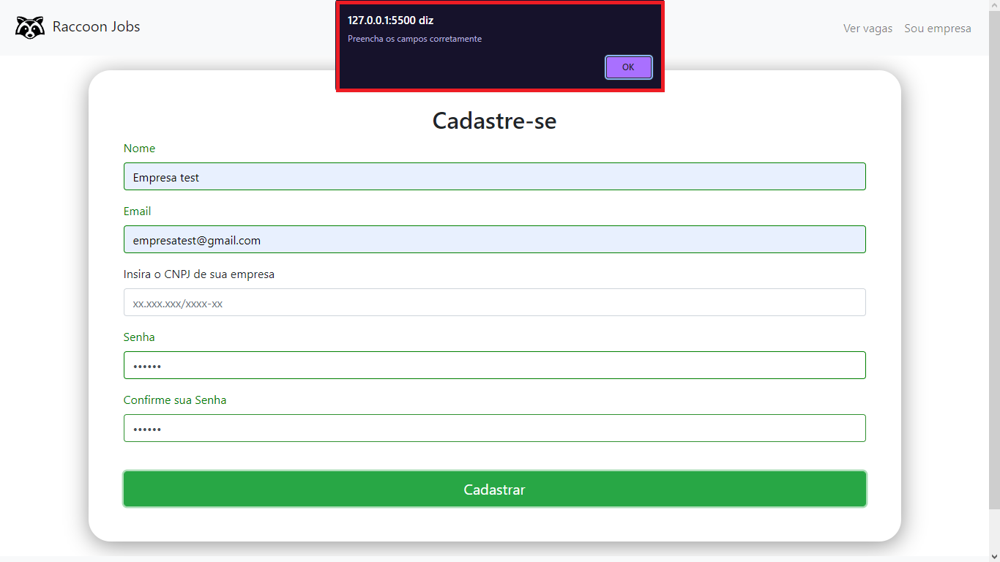

|ID    | Descrição do teste  |  Descrição do resultado | Gravidade|
|------|---------------------|-------------------------|----------|
|CT-?   RF-013| Deve ser possível se cadastrar inserindo uma senha de 6 ou mais caracteres e confirmando a senha | O cadastro foi efetuado com sucesso | Sucesso |

1. Escrever em "Senha" e "Confime sua senha": aA123!

2. Completar outros campos do formulario com informações validas

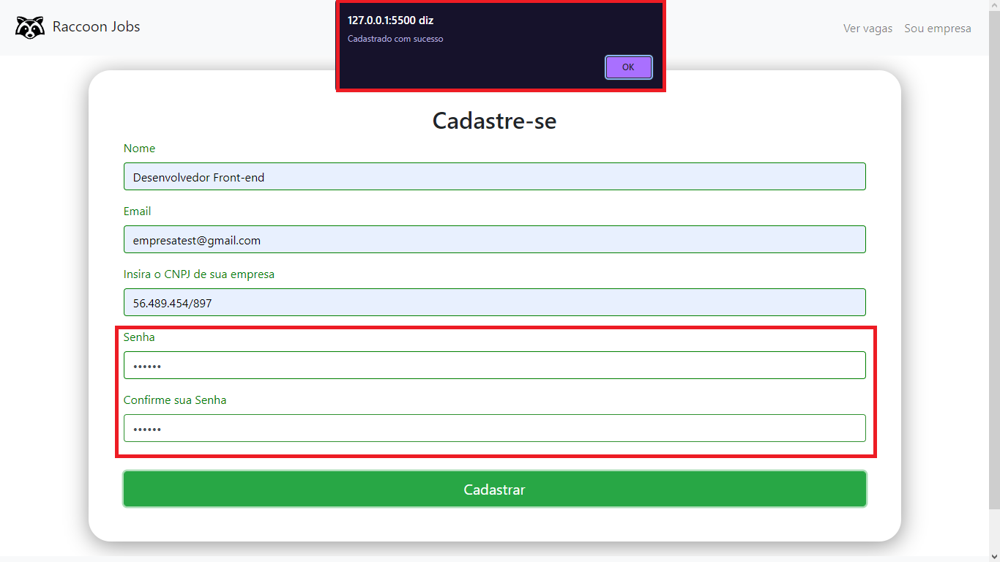

3. Efetuar login com informações cadastradas

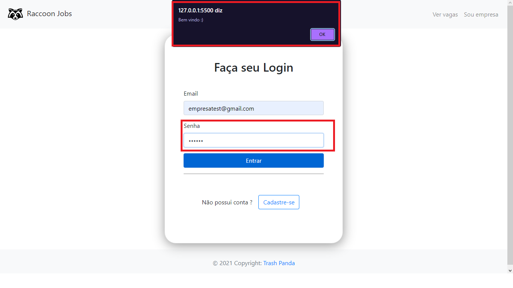
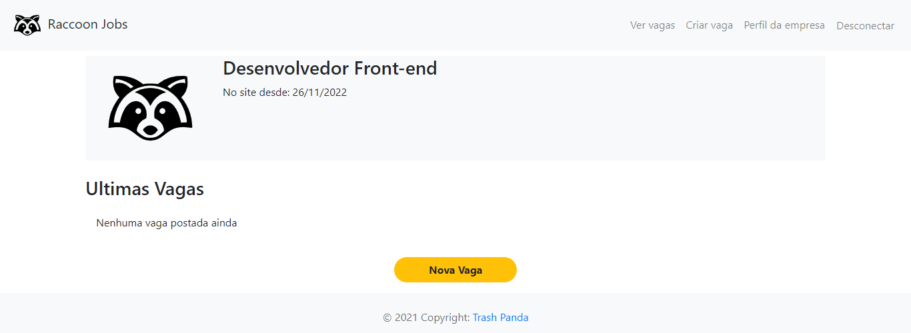

|ID    | Descrição do teste  |  Descrição do resultado | Gravidade|
|------|---------------------|-------------------------|----------|
|CT-?   RF-013| Deve ser impossível se cadastrar inserindo uma senha com menos de 6 caracteres | Um erro aconteceu como o esperado  | Sucesso |

1. Escrever em "Senha" e "Confime sua senha": 12345
2. Completar outros campos do formulario com informações validas
3. Clicar em Cadastrar

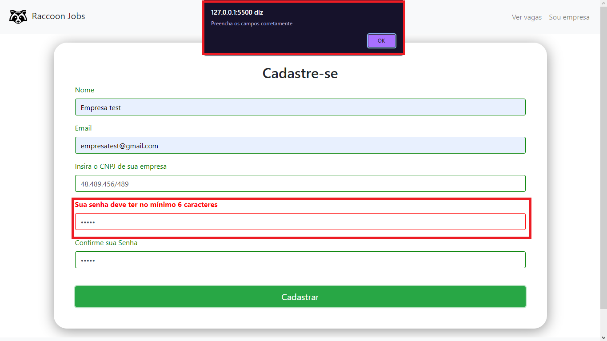

|ID    | Descrição do teste  |  Descrição do resultado | Gravidade|
|------|---------------------|-------------------------|----------|
|CT-?   RF-013| Deve ser impossível se cadastrar inserindo uma senha e um confime sua senha diferentes, mesmo que a senha seja valida | Um erro aconteceu como o esperado  | Sucesso |

1. Escrever em "Senha": 123456 e em "Confime sua senha": 1234567
2. Completar outros campos do formulario com informações validas
3. Clicar em Cadastrar

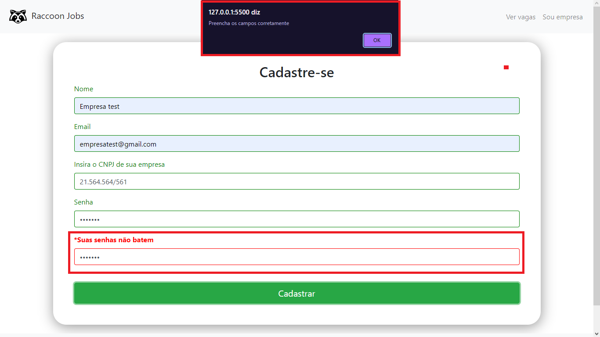

|ID    | Descrição do teste  |  Descrição do resultado | Gravidade|
|------|---------------------|-------------------------|----------|
|CT-?   RF-013| Deve ser impossível se cadastrar sem inserir uma senha | Um erro aconteceu como o esperado  | Sucesso |

1. Em "Senha" e em "Confime sua senha": deixar em branco
2. Completar outros campos do formulario com informações validas
3. Clicar em Cadastrar

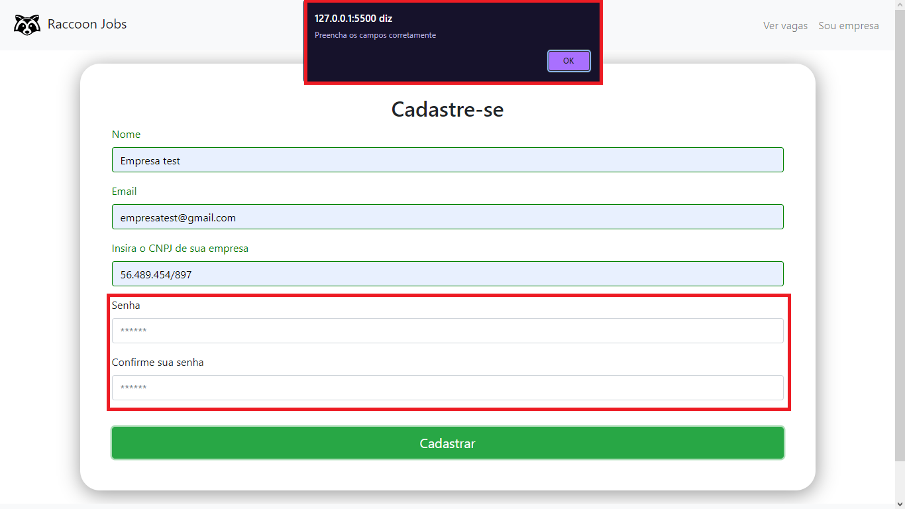
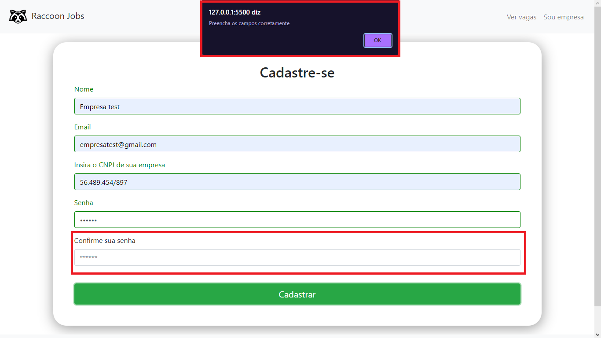
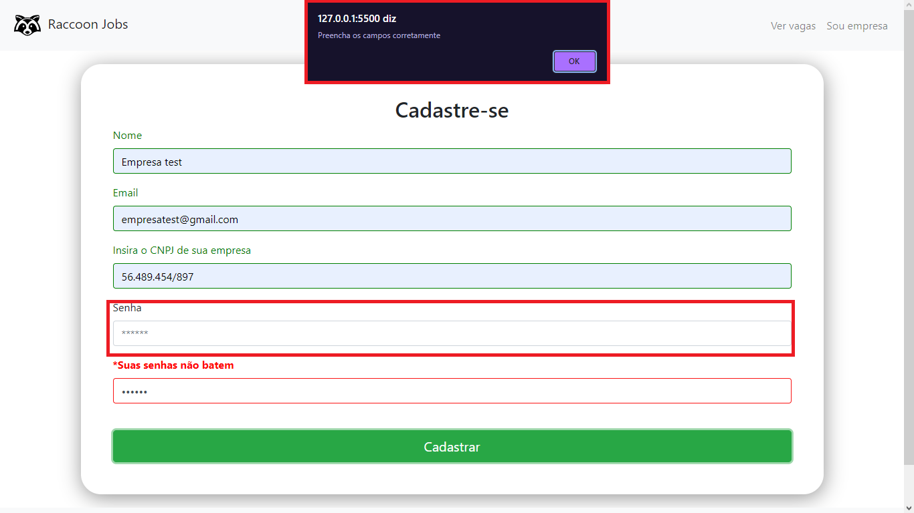

|ID    | Descrição do teste  |  Descrição do resultado | Gravidade|
|------|---------------------|-------------------------|----------|
|CT-?   RF-013| Deve ser impossível se cadastrar duas vezes com o mesmo Email | O cadastro foi criado indevidamente na segunda tentativa | Grave |

1. Cadastar com o email: empresarepetida@gmail.com
2. Completar outros campos do formulario com informações validas
3. Clicar em Cadastrar
1. Cadastar novamente com o email: empresarepetida@gmail.com
2. Completar outros campos do formulario com informações validas
3. Clicar em Cadastrar

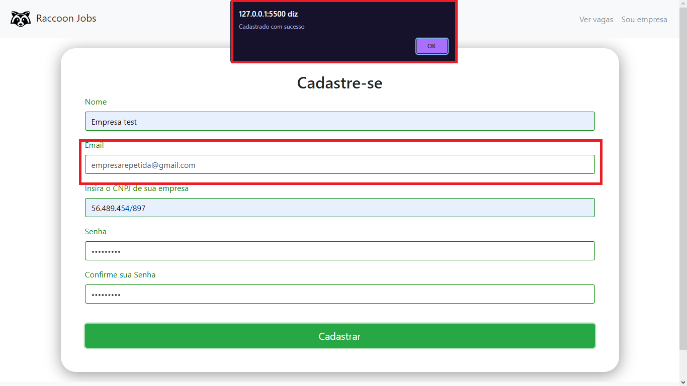
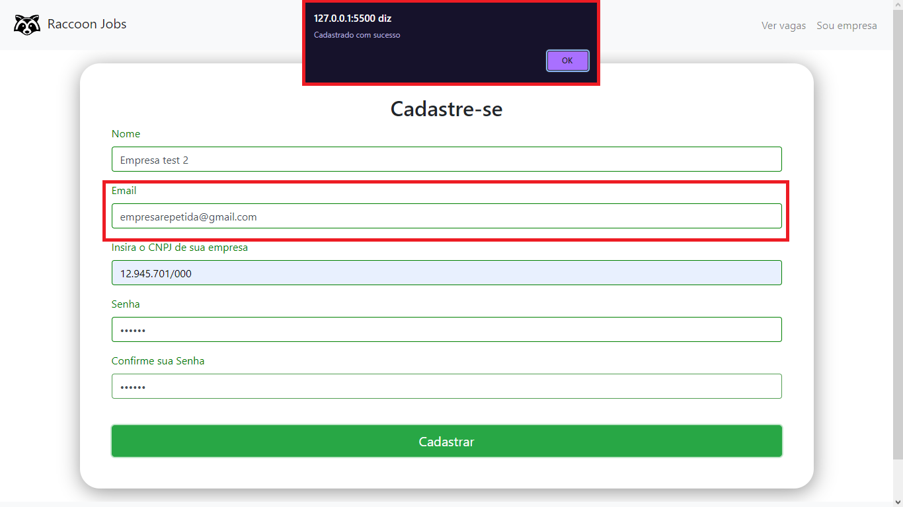

|ID    | Descrição do teste  |  Descrição do resultado | Gravidade|
|------|---------------------|-------------------------|----------|
|CT-?   RF-013| Deve ser impossível se cadastrar duas vezes com o mesmo Nome | O cadastro foi criado indevidamente na segunda tentativa | Media |

1. Cadastar com o Nome: EmpresaRepetida
2. Completar outros campos do formulario com informações validas
3. Clicar em Cadastrar
1. Cadastar com o Nome: EmpresaRepetida
2. Completar outros campos do formulario com informações validas
3. Clicar em Cadastrar

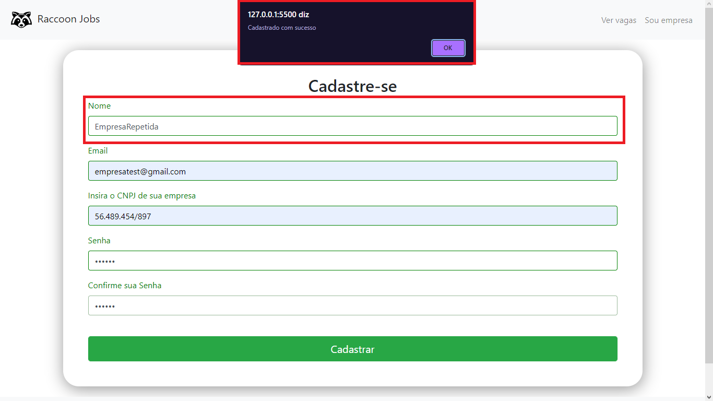
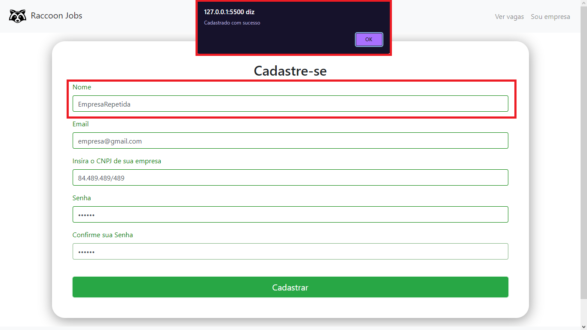

|ID    | Descrição do teste  |  Descrição do resultado | Gravidade|
|------|---------------------|-------------------------|----------|
|CT-?   RF-013| Ao se cadastar, todas as informações digitadas devem estar de acordo com os valores inseridos no formulario de cadastro | As informações estavam de acordo com as cadastradas | Sucesso |

1. Completar campos com: <ol><li>Nome da Empresa: Empresa de testes</li><li>Email: emailtest@gmail.com</li><li>CNPJ: 54.564.864/894</li><li>Senha:!empresaTest123</li><li>Confirme sua senha:!empresaTest123</li></ol>
2. Clicar em Cadastrar
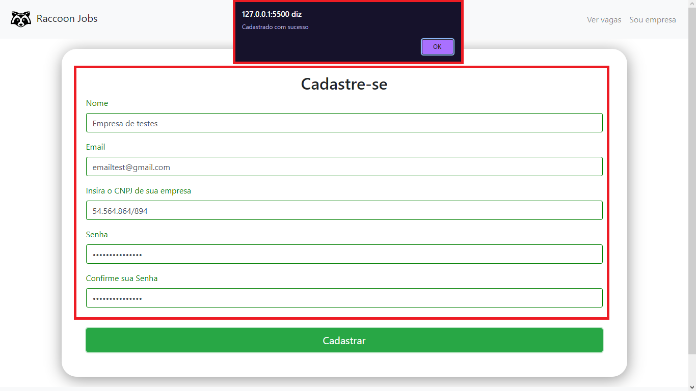
3. Efetuar login
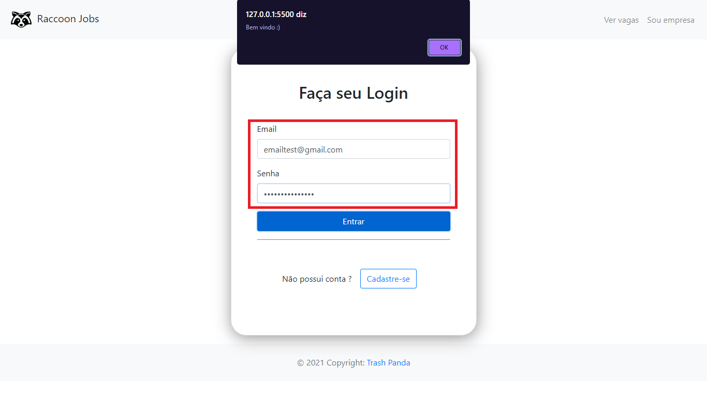
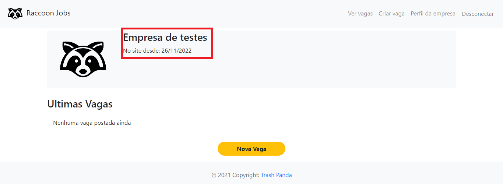

|ID    | Descrição do teste  |  Descrição do resultado | Gravidade|
|------|---------------------|-------------------------|----------|
|CT-?   RF-013| Ao se cadastar, todas as informações digitadas devem estar de acordo com os valores inseridos no formulario de cadastro e devem ser verificadas através de javascript | fixme | fixme |

//Testes e imagens aqui.

# Testes de Navegabilidade completos
|ID    | Descrição do teste  |  Descrição do resultado | Gravidade|
|------|---------------------|-------------------------|----------|
|CT-01   RF-01| É possivel navegar por todos os links da pagina? | |  |
|| Todos os links direcionam para o caminho correto?  | |  |

//Testes e imagens aqui.

|ID    | Descrição do teste  |  Descrição do resultado | Gravidade|
|------|---------------------|-------------------------|----------|
|CT-02   RF-02| É possivel navegar por todos os links da pagina? |  |  |
|| Todos os links direcionam para o caminho correto?  |  |  |

//Testes e imagens aqui.

|ID    | Descrição do teste  |  Descrição do resultado | Gravidade|
|------|---------------------|-------------------------|----------|
|CT-03   RF-03| É possivel navegar por todos os links da pagina? |  |  |
|| Todos os links direcionam para o caminho correto?  |  |  |

//Testes e imagens aqui.

|ID    | Descrição do teste  |  Descrição do resultado | Gravidade|
|------|---------------------|-------------------------|----------|
|CT-04   RF-04| É possivel navegar por todos os links da pagina? |  |  |
|| Todos os links direcionam para o caminho correto?  | |  |

//Testes e imagens aqui.

|ID    | Descrição do teste  |  Descrição do resultado | Gravidade|
|------|---------------------|-------------------------|----------|
|CT-05   RF-05| É possivel navegar por todos os links da pagina? |  |  |
|| Todos os links direcionam para o caminho correto?  |  | 
|
//Testes e imagens aqui.

|ID    | Descrição do teste  |  Descrição do resultado | Gravidade|
|------|---------------------|-------------------------|----------|
|CT-06   RF-13| É possivel navegar por todos os links da pagina? |  |  |
|| Todos os links direcionam para o caminho correto?  |  | |

//Testes e imagens aqui.

# Testes de Navegabilidade completo
|ID    | Descrição do teste  |  Descrição do resultado | Gravidade|
|------|---------------------|-------------------------|----------|
|CT-01   RF-01| É possivel navegar por todos os links da pagina? | |  |
|| Todos os links direcionam para o caminho correto?  | |  |

//Testes e imagens aqui.

|ID    | Descrição do teste  |  Descrição do resultado | Gravidade|
|------|---------------------|-------------------------|----------|
|CT-02   RF-02| É possivel navegar por todos os links da pagina? |  |  |
|| Todos os links direcionam para o caminho correto?  |  |  |

//Testes e imagens aqui.

|ID    | Descrição do teste  |  Descrição do resultado | Gravidade|
|------|---------------------|-------------------------|----------|
|CT-03   RF-03| É possivel navegar por todos os links da pagina? |  |  |
|| Todos os links direcionam para o caminho correto?  |  |  |

//Testes e imagens aqui.

|ID    | Descrição do teste  |  Descrição do resultado | Gravidade|
|------|---------------------|-------------------------|----------|
|CT-04   RF-04| É possivel navegar por todos os links da pagina? |  |  |
|| Todos os links direcionam para o caminho correto?  | |  |

//Testes e imagens aqui.

|ID    | Descrição do teste  |  Descrição do resultado | Gravidade|
|------|---------------------|-------------------------|----------|
|CT-05   RF-05| É possivel navegar por todos os links da pagina? |  |  |
|| Todos os links direcionam para o caminho correto?  |  |  |

//Testes e imagens aqui.

|ID    | Descrição do teste  |  Descrição do resultado | Gravidade|
|------|---------------------|-------------------------|----------|
|CT-06   RF-13| É possivel navegar por todos os links da pagina? |  |  |
|| Todos os links direcionam para o caminho correto?  |  | |

//Testes e imagens aqui.

# Referencias

Pré-requisitos: <a href="3-Projeto de Interface.md"> Projeto de Interface</a>, <a href="8-Plano de Testes de Software.md"> Plano de Testes de Software</a>

Relatório com as evidências dos testes de software realizados no sistema pela equipe, baseado em um plano de testes pré-definido.

## Avaliação

Discorra sobre os resultados do teste. Ressaltando pontos fortes e fracos identificados na solução. Comente como o grupo pretende atacar esses pontos nas próximas iterações. Apresente as falhas detectadas e as melhorias geradas a partir dos resultados obtidos nos testes.

> **Links Úteis**:
> - [Ferramentas de Test para Java Script](https://geekflare.com/javascript-unit-testing/)
