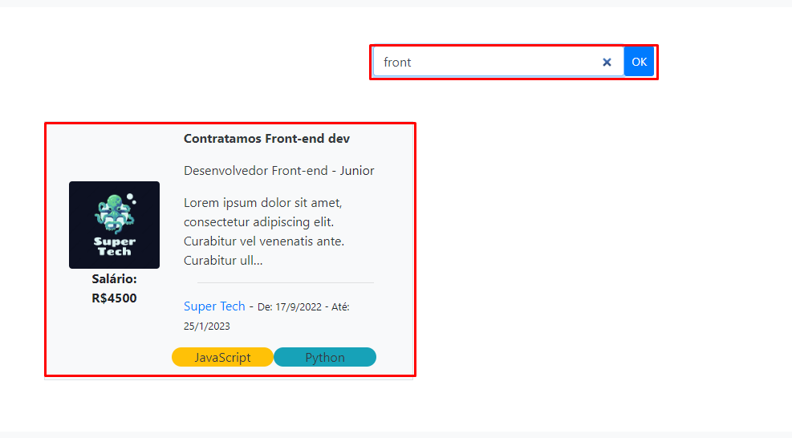
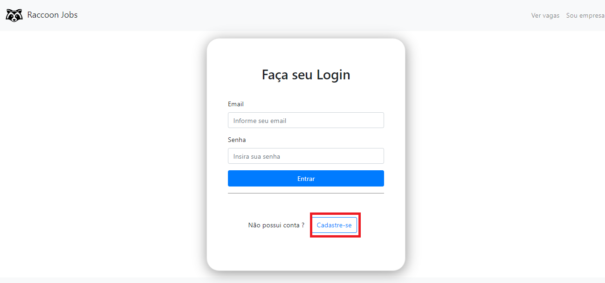
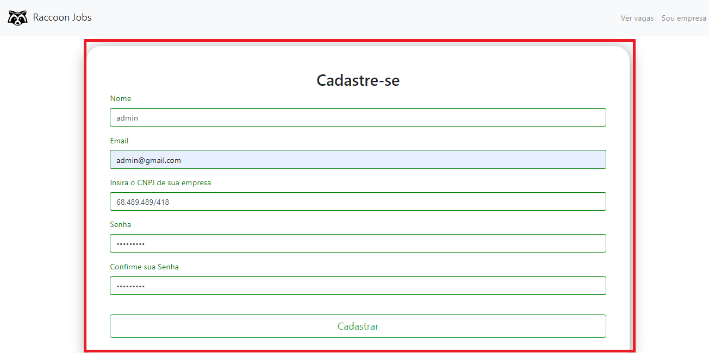

# Registro de Testes de Software

Os resultados obtidos seguindo o <a href="08-Plano de Testes de Software.md"> Plano de Testes de Software </a> serão descritos a seguir

Consulte <a href="02-Especificação do Projeto.md"> Especificação do Projeto </a> para melhor entendimento dos requisitos que serão trabalhados a seguir.

Gravidade

- Sucesso: Nenhuma ação necessária
- Grave: Ação obrigatória antes da entrega final do projeto
- Media: Ação recomendada para melhora da qualidade do software
- Baixa: Ação não obrigatória mas que melhoraria a qualidade do software

# Testes de Ponta a ponta simplificado
|ID    | Descrição do teste  |  Descrição do resultado | Gravidade|
|------|---------------------|-------------------------|----------|
|CT-01   RF-01|  | | | 
|CT-02   RF-02|  | | |
|CT-03   RF-03| Verificar se a página "lista de vagas" está acessível e interativa. | Todos os passos foram executados com êxito | Sucesso |
|CT-04   RF-07| Verificar se a barra de pesquisa e o filtro estão funcionando corretamente | Todos os passos foram executados com êxito | Sucesso | 
|CT-05   RF-05| É possível criar uma nova vaga seguindo todo o processo necessario? | Todos os passos foram executados com êxito | Sucesso |
|CT-06   RF-13| É possível para uma empresa se cadastrar e efetuar login? | Todos os passos foram executados com êxito | Sucesso |

# Testes de Campos simplificado
|ID    | Descrição do teste  |  Descrição do resultado | Gravidade|
|------|---------------------|-------------------------|----------|
|CT-05   RF-05|  |  | | 
|CT-06   RF-13|  |  | |

# Testes de Navegabilidade simplificado
|ID    | Descrição do teste  |  Descrição do resultado | Gravidade|
|------|---------------------|-------------------------|----------|
|CT-01   RF-01| É possivel navegar por todos os links da pagina? | |  |
|| Todos os links direcionam para o caminho correto?  | |  |
|CT-02   RF-02| É possivel navegar por todos os links da pagina? |  |  |
|| Todos os links direcionam para o caminho correto?  |  |  |
|CT-03   RF-03| É possivel navegar por todos os links da pagina? |  |  |
|| Todos os links direcionam para o caminho correto?  |  |  |
|CT-04   RF-04| É possivel navegar por todos os links da pagina? |  |  |
|| Todos os links direcionam para o caminho correto?  | |  |
|CT-05   RF-05| É possivel navegar por todos os links da pagina? |  |  |
|| Todos os links direcionam para o caminho correto?  |  |  |
|CT-06   RF-13| É possivel navegar por todos os links da pagina? |  |  |
|| Todos os links direcionam para o caminho correto?  |  | |

# Testes de Responsividade simplificado
|ID    | Descrição do teste  |  Descrição do resultado | Gravidade|
|------|---------------------|-------------------------|----------|
|CT-01   RF-01| A pagina é responsiva para desktop, tablet e smartphone? |  |  |
|CT-02   RF-02| A pagina é responsiva para desktop, tablet e smartphone? |  |  |
|CT-03   RF-03| A pagina é responsiva para desktop, tablet e smartphone? |  |  |
|CT-04   RF-04| A pagina é responsiva para desktop, tablet e smartphone? |  |  |
|CT-05   RF-05| A pagina é responsiva para desktop, tablet e smartphone? |  |  |
|CT-06   RF-13| A pagina é responsiva para desktop, tablet e smartphone? |  |  |

# Testes de Ponta a ponta Completos

|ID    | Descrição do teste  |  Descrição do resultado | Gravidade|
|------|---------------------|-------------------------|----------|
|CT-01   RF-01|  | | | 

//Testes e imagens aqui.

|ID    | Descrição do teste  |  Descrição do resultado | Gravidade|
|------|---------------------|-------------------------|----------|
|CT-02   RF-02|  | | | 

//Testes e imagens aqui.

|ID    | Descrição do teste  |  Descrição do resultado | Gravidade|
|------|---------------------|-------------------------|----------|
|CT-XX   RF-03| Verificar se a página "lista de vagas" está acessível e interativa. | A página se mostrou em pleno funcionamento, apresentando a lista de vagas adequadamente  | Sucesso |

Acessando pela home page e clicando no botão "ver vagas":

Acessando a página "Lista de Vagas"

|ID    | Descrição do teste  |  Descrição do resultado | Gravidade|
|------|---------------------|-------------------------|----------|
|CT-XX   RF-07|Verificar se a barra de pesquisa da página "lista de vagas" está funcionando corretamente| A barra de pesquisa funcionou perfeitamente retornando resultado esperados do teste |Sucesso | 

Objetivo: Testar barra de busca; 

Pesquisar: front 

Saída esperada: Vaga de desenvolvedor Front End pela Super Tech

|ID    | Descrição do teste  |  Descrição do resultado | Gravidade|
|------|---------------------|-------------------------|----------|
|CT-XX   RF-07|Verificar se a barra de pesquisa da página "lista de vagas" está funcionando corretamente| A barra de pesquisa funcionou perfeitamente retornando resultado esperados do teste |Sucesso | 

Objetivo: Testar barra de busca

Pesquisar : psicologo 

Saída esperada: Uma lista vazia com a seguinte mensagem: Não existem vagas no momento, tente alterar seus filtros.

|ID    | Descrição do teste  |  Descrição do resultado | Gravidade|
|------|---------------------|-------------------------|----------|
|CT-XX   RF-07|Verificar se o filtro por categoria da página "lista de vagas" está funcionando corretamente| O filtro por categoria funcionou perfeitamente retornando resultado esperados do teste |Sucesso | 

Objetivo: Testar filtro de categoria 

Filtrar por: React 

Saída esperada : Vaga de desenvolvedor back-end pela Progressus

|ID    | Descrição do teste  |  Descrição do resultado | Gravidade|
|------|---------------------|-------------------------|----------|
|CT-05   RF-05| É possível criar uma nova vaga seguindo todo o processo necessario? | Todos os passos foram executados com êxito |  Sucesso |

1. Acessar a pagina inicial e clicar em "Sou Empresa"

2. Efetuar login

3. Clicar em Nova Vaga

4. Preencher formulario e enviar

|ID    | Descrição do teste  |  Descrição do resultado | Gravidade|
|------|---------------------|-------------------------|----------|
|CT-06   RF-13| É possível para uma empresa se cadastrar e efetuar login? | Todos os passos foram executados com êxito | Sucesso |

1. Acessar a pagina inicial e clicar em "Sou Empresa"

2. Clicar em Cadaste-se

3. Efetuar cadastro com sucesso ao preencher informações

4. Efetuar login

5. Ser redirecionado para a pagina da sua empresa

# Testes de Campos completos
|ID    | Descrição do teste  |  Descrição do resultado | Gravidade|
|------|---------------------|-------------------------|----------|
|CT-05   RF-05|  |  | | 

//Testes e imagens aqui.

|ID    | Descrição do teste  |  Descrição do resultado | Gravidade|
|------|---------------------|-------------------------|----------|
|CT-06   RF-13|  |  | |

//Testes e imagens aqui.

# Testes de Navegabilidade completos
|ID    | Descrição do teste  |  Descrição do resultado | Gravidade|
|------|---------------------|-------------------------|----------|
|CT-01   RF-01| É possivel navegar por todos os links da pagina? | |  |
|| Todos os links direcionam para o caminho correto?  | |  |

//Testes e imagens aqui.

|ID    | Descrição do teste  |  Descrição do resultado | Gravidade|
|------|---------------------|-------------------------|----------|
|CT-02   RF-02| É possivel navegar por todos os links da pagina? |  |  |
|| Todos os links direcionam para o caminho correto?  |  |  |

//Testes e imagens aqui.

|ID    | Descrição do teste  |  Descrição do resultado | Gravidade|
|------|---------------------|-------------------------|----------|
|CT-03   RF-03| É possivel navegar por todos os links da pagina? |  |  |
|| Todos os links direcionam para o caminho correto?  |  |  |

//Testes e imagens aqui.

|ID    | Descrição do teste  |  Descrição do resultado | Gravidade|
|------|---------------------|-------------------------|----------|
|CT-04   RF-04| É possivel navegar por todos os links da pagina? |  |  |
|| Todos os links direcionam para o caminho correto?  | |  |

//Testes e imagens aqui.

|ID    | Descrição do teste  |  Descrição do resultado | Gravidade|
|------|---------------------|-------------------------|----------|
|CT-05   RF-05| É possivel navegar por todos os links da pagina? |  |  |
|| Todos os links direcionam para o caminho correto?  |  | 
|
//Testes e imagens aqui.

|ID    | Descrição do teste  |  Descrição do resultado | Gravidade|
|------|---------------------|-------------------------|----------|
|CT-06   RF-13| É possivel navegar por todos os links da pagina? |  |  |
|| Todos os links direcionam para o caminho correto?  |  | |

//Testes e imagens aqui.

# Testes de Navegabilidade completo
|ID    | Descrição do teste  |  Descrição do resultado | Gravidade|
|------|---------------------|-------------------------|----------|
|CT-01   RF-01| É possivel navegar por todos os links da pagina? | |  |
|| Todos os links direcionam para o caminho correto?  | |  |

//Testes e imagens aqui.

|ID    | Descrição do teste  |  Descrição do resultado | Gravidade|
|------|---------------------|-------------------------|----------|
|CT-02   RF-02| É possivel navegar por todos os links da pagina? |  |  |
|| Todos os links direcionam para o caminho correto?  |  |  |

//Testes e imagens aqui.

|ID    | Descrição do teste  |  Descrição do resultado | Gravidade|
|------|---------------------|-------------------------|----------|
|CT-03   RF-03| É possivel navegar por todos os links da pagina? |  |  |
|| Todos os links direcionam para o caminho correto?  |  |  |

//Testes e imagens aqui.

|ID    | Descrição do teste  |  Descrição do resultado | Gravidade|
|------|---------------------|-------------------------|----------|
|CT-04   RF-04| É possivel navegar por todos os links da pagina? |  |  |
|| Todos os links direcionam para o caminho correto?  | |  |

//Testes e imagens aqui.

|ID    | Descrição do teste  |  Descrição do resultado | Gravidade|
|------|---------------------|-------------------------|----------|
|CT-05   RF-05| É possivel navegar por todos os links da pagina? |  |  |
|| Todos os links direcionam para o caminho correto?  |  |  |

//Testes e imagens aqui.

|ID    | Descrição do teste  |  Descrição do resultado | Gravidade|
|------|---------------------|-------------------------|----------|
|CT-06   RF-13| É possivel navegar por todos os links da pagina? |  |  |
|| Todos os links direcionam para o caminho correto?  |  | |

//Testes e imagens aqui.

# Referencias

Pré-requisitos: <a href="3-Projeto de Interface.md"> Projeto de Interface</a>, <a href="8-Plano de Testes de Software.md"> Plano de Testes de Software</a>

Relatório com as evidências dos testes de software realizados no sistema pela equipe, baseado em um plano de testes pré-definido.

## Avaliação

Discorra sobre os resultados do teste. Ressaltando pontos fortes e fracos identificados na solução. Comente como o grupo pretende atacar esses pontos nas próximas iterações. Apresente as falhas detectadas e as melhorias geradas a partir dos resultados obtidos nos testes.

> **Links Úteis**:
> - [Ferramentas de Test para Java Script](https://geekflare.com/javascript-unit-testing/)
